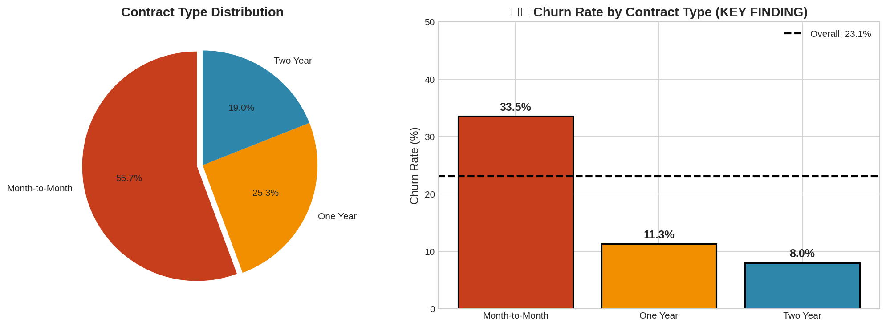
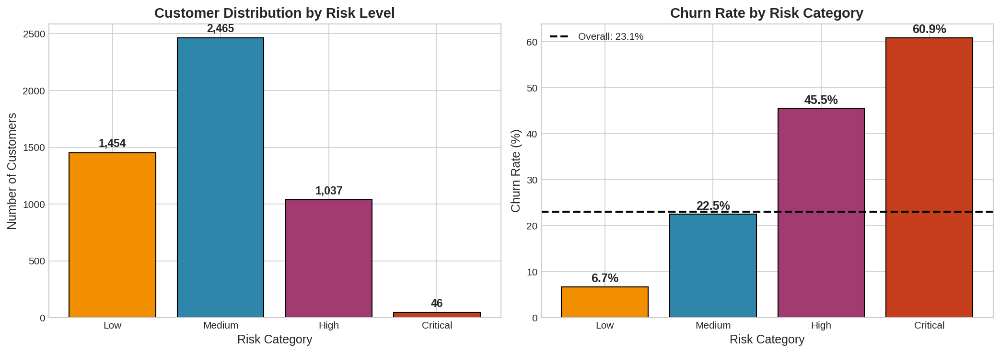
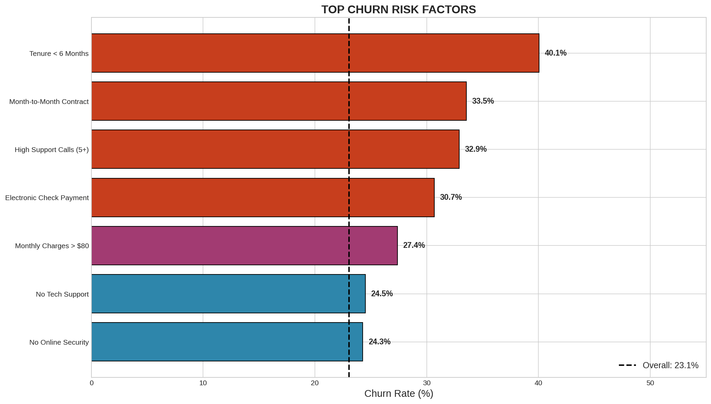

# 📊 Customer Churn Analysis: Comprehensive EDA


## Overview

This project presents a comprehensive Exploratory Data Analysis (EDA) of customer churn for a telecommunications company. The analysis examines ~5,000 customer records to identify key factors driving customer attrition and provides actionable business recommendations.

## 🎯 Key Findings

1. **Contract Type is the #1 Predictor**: Month-to-Month customers churn at 37%+ vs 3-11% for longer contracts
2. **Payment Method Matters**: Electronic Check users have significantly higher churn rates
3. **First 6 Months are Critical**: New customers have the highest churn risk
4. **Support Services Reduce Churn**: Customers with Tech Support and Online Security are more likely to stay
5. **High Support Calls = Warning Sign**: Customers with 5+ support calls are high-risk

## 📁 Project Structure

```
01-exploratory-data-analysis/
├── README.md
├── customer_churn_eda.ipynb    # Main analysis notebook
├── data/
│   ├── telecom_customer_churn.csv      # Raw dataset
│   └── telecom_churn_cleaned.csv       # Cleaned dataset
└── images/                              # Generated visualizations
    ├── 01_churn_distribution.png
    ├── 02_gender_analysis.png
    ├── 03_age_analysis.png
    └── ... (14 charts total)
```

## 📈 Analysis Sections

1. **Data Loading & Inspection** - Initial exploration of the dataset
2. **Data Cleaning** - Handling duplicates, missing values, and data types
3. **Target Variable Analysis** - Understanding churn distribution
4. **Demographic Analysis** - Gender, age, and location patterns
5. **Contract & Tenure Analysis** - Impact of contract type and customer tenure
6. **Financial Analysis** - Monthly charges and revenue patterns
7. **Payment Method Analysis** - Billing method impact on retention
8. **Services Analysis** - How support services affect churn
9. **Correlation Analysis** - Numerical variable relationships
10. **Statistical Testing** - Chi-square and T-tests for significance
11. **Risk Segmentation** - Multi-factor risk scoring model
12. **Business Recommendations** - Actionable strategies

## 🛠️ Technologies Used

- **Python 3.12**
- **Pandas** - Data manipulation
- **NumPy** - Numerical operations
- **Matplotlib** - Static visualizations
- **Seaborn** - Statistical visualizations
- **SciPy** - Statistical testing

## 📊 Sample Visualizations

### Churn by Contract Type


### Risk Segmentation


### Key Churn Factors


## 🚀 How to Run

1. Clone this repository
2. Install dependencies:
   ```bash
   pip install pandas numpy matplotlib seaborn scipy jupyter
   ```
3. Open and run the Jupyter notebook:
   ```bash
   jupyter notebook customer_churn_eda.ipynb
   ```

## 💡 Business Recommendations

| Priority | Strategy | Expected Impact |
|----------|----------|-----------------|
| 1 | Incentivize contract upgrades | Reduce churn by 2-3% |
| 2 | Auto-pay enrollment incentives | Reduce churn by 1-2% |
| 3 | Enhanced new customer onboarding | Improve early retention |
| 4 | Bundle support services | Reduce churn by 2-4% |
| 5 | Proactive intervention for high-support customers | Recover 20-30% at-risk |

## 📌 Next Steps

- **Project 2**: Build ML classification model for churn prediction
- **Project 3**: Time series analysis of churn trends
- **Dashboard**: Real-time churn risk monitoring

## 👤 Author

**Alexy Louis**  
Data Analyst

📧 alexy.louis.scholar@gmail.com  
🔗 [LinkedIn](https://www.linkedin.com/in/alexy-louis-19a5a9262/)  
💻 [GitHub](https://github.com/Smooth-Cactus0)

---

*This project is part of my Data Analysis Portfolio. See the [main repository](../) for more projects.*
