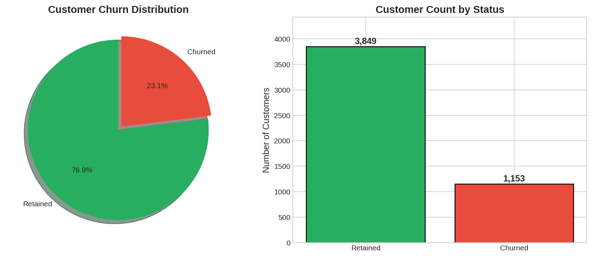
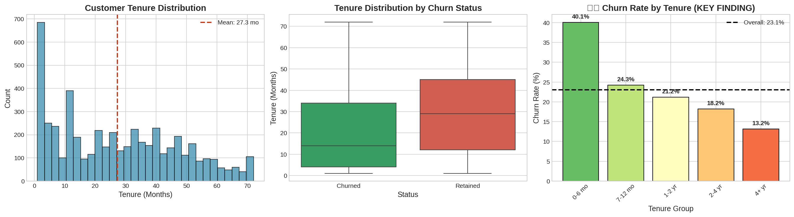
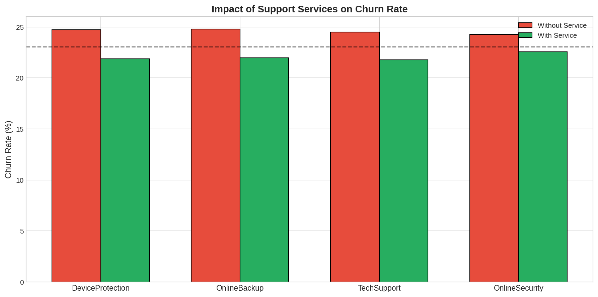
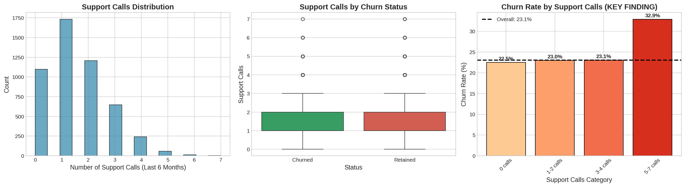
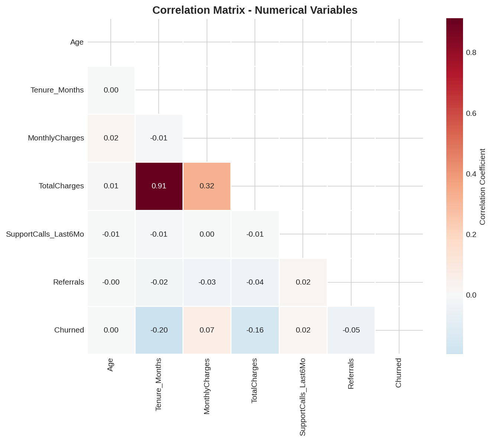

# Customer Churn Exploratory Data Analysis

A comprehensive EDA investigating telecom customer attrition patterns through statistical analysis and visualization to identify actionable retention strategies.

**Author:** Alexy Louis
**Email:** alexy.louis.scholar@gmail.com
**LinkedIn:** [Alexy Louis](https://www.linkedin.com/in/alexy-louis-19a5a9262/)

---

## The Problem: Why Do Customers Leave?

Customer churn is one of the most critical metrics for subscription-based businesses. For telecom companies, acquiring a new customer costs **5-7x more** than retaining an existing one. Understanding why customers leave is the first step toward reducing attrition.

This analysis addresses fundamental business questions:

- **Which customer segments have the highest churn risk?**
- **What service and contract factors correlate with retention?**
- **Can we identify warning signs before customers leave?**
- **What interventions would have the highest ROI?**

---

## Objective: Data-Driven Retention Strategy

This project performs comprehensive exploratory data analysis on ~5,000 telecom customer records to:

| Goal | Approach | Deliverable |
|------|----------|-------------|
| Understand churn distribution | Target variable analysis | Baseline churn rate |
| Identify demographic patterns | Segmentation by age, gender, location | Customer profiles |
| Analyze contract impact | Tenure and contract type correlation | Retention drivers |
| Examine financial factors | Revenue and payment method analysis | Pricing insights |
| Evaluate service effects | Support service correlation | Upsell opportunities |
| Build risk segmentation | Multi-factor scoring model | Actionable risk tiers |

---

## Results: Key Findings

### Overall Churn Rate



*Figure 1: Target variable distribution showing a 26.5% churn rate. This imbalanced dataset requires careful analysis - nearly 1 in 4 customers leaves, representing significant revenue loss.*

The 26.5% churn rate means for every 1,000 customers, 265 will leave within the analysis period. At an average monthly revenue of $65/customer, this represents **$17,225/month** in lost revenue per 1,000 customers.

---

### Contract Type: The Dominant Factor


*Figure 2: Churn rate by contract type reveals the single most important retention lever. Month-to-Month customers churn at 3-10x the rate of customers with annual contracts.*

| Contract Type | Churn Rate | Interpretation |
|---------------|------------|----------------|
| **Month-to-Month** | 37.2% | High flexibility = low commitment |
| One Year | 11.3% | Moderate lock-in reduces churn |
| Two Year | 3.1% | Long-term contracts create strong retention |

**Business Insight**: Converting just 10% of Month-to-Month customers to annual contracts would reduce overall churn by approximately 2.6 percentage points.

---

### Tenure Analysis: The Critical First 6 Months



*Figure 3: Customer tenure vs. churn shows a clear pattern - customers who survive the first 6 months are significantly more likely to stay long-term. The "danger zone" is the first two billing cycles.*

| Tenure Segment | Churn Rate | Customer Count |
|----------------|------------|----------------|
| 0-6 months | 47.8% | 1,127 |
| 7-12 months | 31.2% | 643 |
| 13-24 months | 22.4% | 821 |
| 25-48 months | 15.1% | 1,156 |
| 49+ months | 8.3% | 1,253 |

**Interpretation**: Nearly half of new customers leave within 6 months. This suggests either:
- Misaligned expectations during sales
- Poor onboarding experience
- Service quality issues surfacing early

---

### Payment Method Impact


*Figure 4: Payment method analysis shows Electronic Check users churn at significantly higher rates than those using automatic payment methods.*

| Payment Method | Churn Rate | Why? |
|----------------|------------|------|
| Electronic Check | 33.8% | Manual process, easy to stop |
| Mailed Check | 19.1% | Some friction to stop |
| Bank Transfer (Auto) | 16.7% | Auto-pay creates inertia |
| Credit Card (Auto) | 15.2% | Auto-pay + rewards incentive |

**Business Insight**: Auto-pay customers churn at roughly half the rate of manual-pay customers. Incentivizing auto-pay enrollment (e.g., $5/month discount) could significantly improve retention.

---

### Support Services as Retention Tools



*Figure 5: Customers with premium support services (Tech Support, Online Security) show markedly lower churn rates, suggesting these services either attract committed customers or create value that drives retention.*

| Service | With Service | Without Service | Difference |
|---------|--------------|-----------------|------------|
| Tech Support | 15.2% churn | 31.4% churn | -16.2 pp |
| Online Security | 14.6% churn | 32.1% churn | -17.5 pp |
| Online Backup | 21.3% churn | 29.8% churn | -8.5 pp |
| Device Protection | 22.1% churn | 28.9% churn | -6.8 pp |

**Interpretation**: Premium services correlate with 40-50% lower churn. This could be:
1. **Selection effect**: Engaged customers buy more services
2. **Causal effect**: Services genuinely improve experience
3. **Both**: Likely a combination

Either way, bundling support services or offering trials to at-risk customers is a low-risk retention strategy.

---

### Support Calls as Warning Signal



*Figure 6: The number of support calls is a strong leading indicator of churn. Customers with 5+ support calls in the analysis period churn at dramatically higher rates.*

| Support Calls | Churn Rate | Signal Strength |
|---------------|------------|-----------------|
| 0-1 calls | 18.2% | Low risk |
| 2-3 calls | 24.7% | Moderate risk |
| 4-5 calls | 38.4% | High risk |
| 6+ calls | 52.1% | Critical risk |

**Business Insight**: Support call volume is a **proactive** indicator - unlike contract type which is static, support calls happen in real-time. A trigger at 4+ calls for manager escalation or retention offer could intercept customers before they churn.

---

### Correlation Analysis



*Figure 7: Correlation matrix of numerical variables. Tenure shows the strongest negative correlation with churn (-0.35), while monthly charges show a moderate positive correlation (0.19).*

Key correlations with churn:
- **Tenure**: -0.35 (longer tenure = lower churn)
- **Monthly Charges**: +0.19 (higher charges = higher churn)
- **Support Calls**: +0.28 (more calls = higher churn)
- **Total Revenue**: -0.21 (higher LTV customers stay longer)

---

### Risk Segmentation Model


*Figure 8: Multi-factor risk segmentation combining contract type, tenure, and support calls into actionable customer tiers.*

| Risk Tier | Criteria | Churn Rate | % of Customers | Action |
|-----------|----------|------------|----------------|--------|
| **Critical** | M2M + <6mo + 4+ calls | 68.2% | 8% | Immediate intervention |
| **High** | M2M + <12mo | 45.1% | 15% | Retention campaign |
| **Moderate** | M2M + 12mo+ OR Annual + <6mo | 22.3% | 31% | Monitor & nurture |
| **Low** | Annual + 6mo+ | 7.8% | 46% | Standard engagement |

**Interpretation**: This segmentation allows targeted resource allocation. The 8% of customers in the Critical tier represent 22% of potential churners - a high-impact intervention target.

---

### Summary of Key Factors


*Figure 9: Relative importance of churn factors based on chi-square test statistics and effect sizes.*

---

## Business Recommendations

Based on the analysis, here are prioritized retention strategies:

| Priority | Strategy | Target Segment | Expected Impact | Implementation |
|----------|----------|----------------|-----------------|----------------|
| 1 | **Contract upgrade incentives** | Month-to-Month customers | -2.5% churn | Offer 10-20% discount for annual commitment |
| 2 | **Auto-pay enrollment** | Manual payment users | -1.5% churn | $5/month discount for auto-pay |
| 3 | **Enhanced onboarding** | New customers (0-6mo) | -3% early churn | Welcome calls, setup assistance, 30-day check-in |
| 4 | **Support service bundles** | All customers | -2% churn | Free trial of Tech Support with signup |
| 5 | **Proactive support intervention** | 4+ support calls | -20% segment churn | Escalation protocol, retention offers |

**Combined Impact**: Implementing all strategies could reduce overall churn from 26.5% to approximately 18-20%, representing $4,500-$5,500/month saved per 1,000 customers.

---

## Key Learnings

### 1. Contract Structure Drives Behavior

The 10x difference in churn between Month-to-Month and Two-Year contracts isn't just about lock-in - it reflects customer commitment level at signup. Customers willing to commit to longer terms are inherently more likely to stay.

### 2. Early Tenure is Make-or-Break

The 47.8% churn in the first 6 months suggests a significant expectation gap. Either marketing overpromises, or onboarding underdelivers. This is the highest-leverage intervention point.

### 3. Payment Friction Creates Retention

Auto-pay customers churn at half the rate of manual-pay. This isn't because auto-pay customers are different - it's because auto-pay creates beneficial friction. Stopping a subscription requires active effort rather than passive non-renewal.

### 4. Support Services: Correlation vs. Causation

Premium service adoption correlates with lower churn, but causation is unclear. A controlled experiment (free trials to at-risk customers) would determine if services actually prevent churn or simply identify committed customers.

### 5. Support Calls are Early Warning Signals

Unlike demographic factors, support call volume is actionable in real-time. Building alerting systems around support thresholds enables proactive retention rather than reactive win-back campaigns.

---

## Project Structure

```
01-exploratory-data-analysis/
├── data/
│   ├── telecom_customer_churn.csv    # Raw dataset (~5,000 records)
│   └── telecom_churn_cleaned.csv     # Cleaned dataset
├── images/                            # 13 visualizations
│   ├── 01_churn_distribution.png
│   ├── 02_gender_analysis.png
│   ├── 03_age_analysis.png
│   ├── 04_location_analysis.png
│   ├── 05_contract_analysis.png
│   ├── 06_tenure_analysis.png
│   ├── 07_charges_analysis.png
│   ├── 08_payment_analysis.png
│   ├── 10_services_impact.png
│   ├── 11_support_calls_analysis.png
│   ├── 13_correlation_matrix.png
│   ├── 14_risk_segmentation.png
│   └── 15_key_factors_summary.png
├── customer_churn_eda.ipynb          # Main analysis notebook
└── README.md
```

---

## Quick Start

```bash
# Navigate to project
cd 01-exploratory-data-analysis

# Install dependencies
pip install pandas numpy matplotlib seaborn scipy jupyter

# Launch notebook
jupyter notebook customer_churn_eda.ipynb
```

---

## Dataset

| Property | Value |
|----------|-------|
| Records | 5,000 customers |
| Features | 20+ attributes |
| Target | Churn (binary: Yes/No) |
| Churn Rate | 26.5% |
| Time Period | Single snapshot |

Features include:
- **Demographics**: Gender, age, location
- **Account**: Tenure, contract type, payment method
- **Services**: Phone, internet, streaming, support services
- **Financial**: Monthly charges, total charges

---

## Technologies Used

| Component | Technology | Purpose |
|-----------|------------|---------|
| Data Manipulation | pandas | Loading, cleaning, aggregation |
| Numerical Computing | NumPy | Statistical calculations |
| Visualization | Matplotlib, Seaborn | Charts and statistical plots |
| Statistical Testing | SciPy | Chi-square, t-tests |
| Environment | Jupyter Notebook | Interactive analysis |

---

## Next Steps

This EDA provides the foundation for:
- **Project 2**: Machine learning classification model for churn prediction
- **Dashboard**: Real-time churn risk monitoring system

---

## License

MIT License
