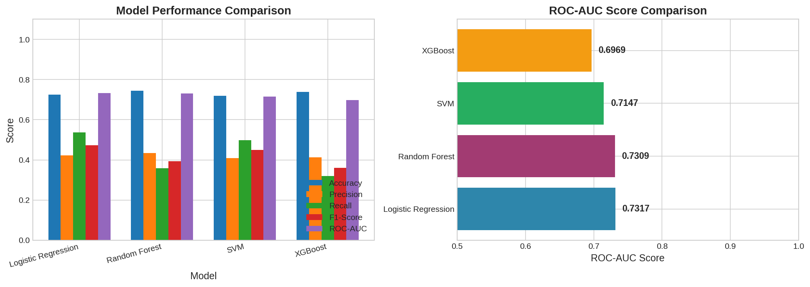
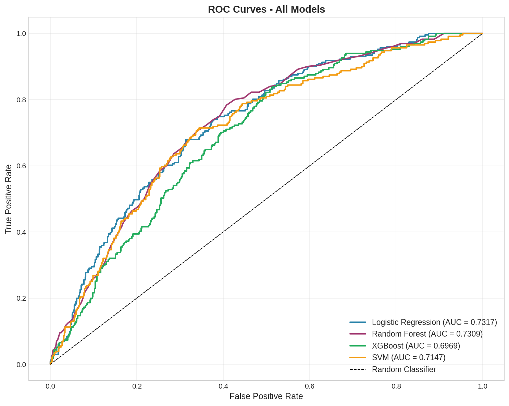
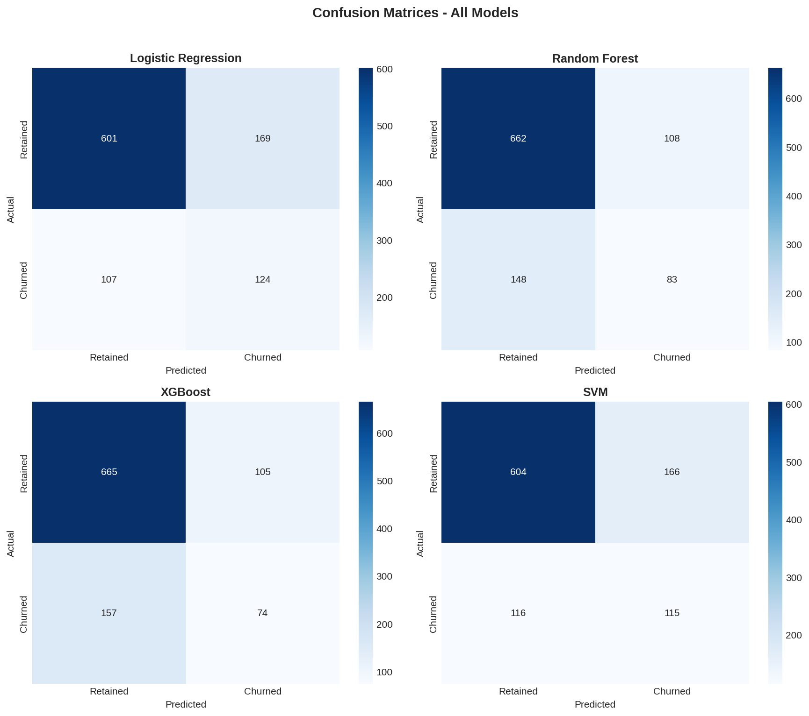
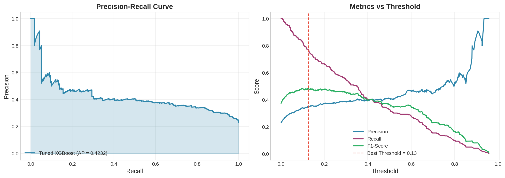
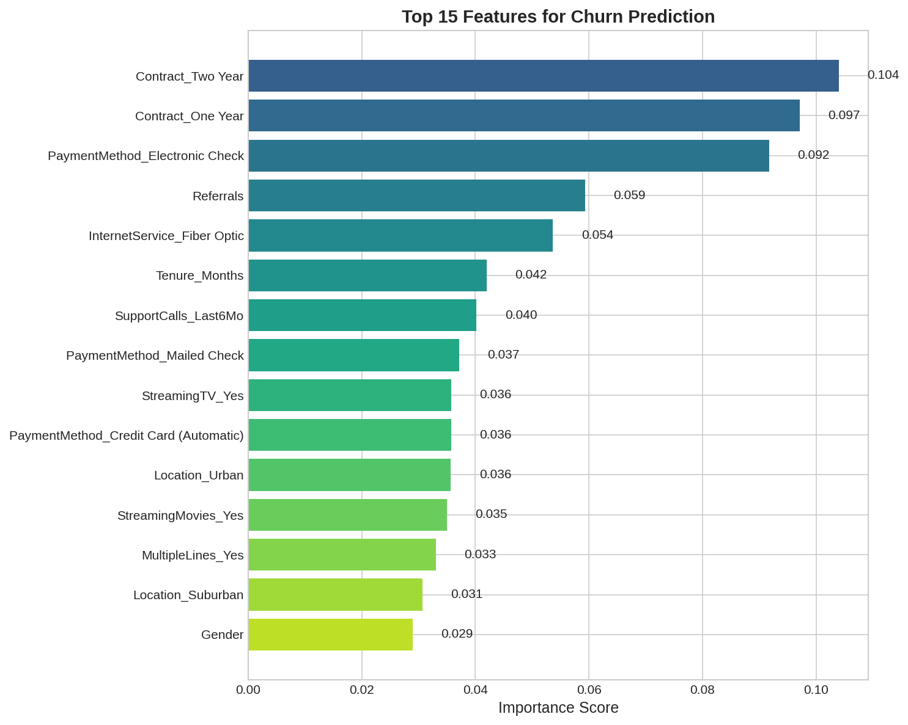
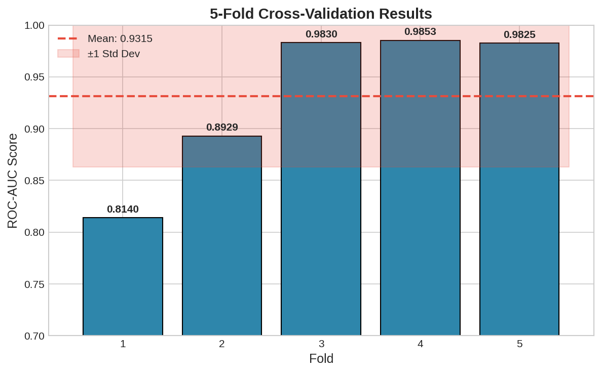
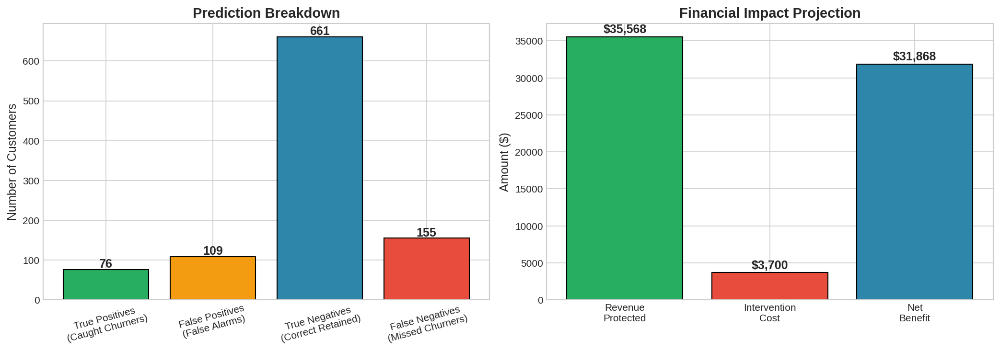

# Customer Churn Prediction: Machine Learning Classification

A production-ready ML pipeline for predicting customer attrition, comparing four classification algorithms and optimizing for business impact.

**Author:** Alexy Louis
**Email:** alexy.louis.scholar@gmail.com
**LinkedIn:** [Alexy Louis](https://www.linkedin.com/in/alexy-louis-19a5a9262/)

---

## The Problem: From Understanding to Action

In [Project 1 (EDA)](../01-exploratory-data-analysis/), we identified the key factors driving customer churn. Now we need to operationalize those insights by building a model that can:

1. **Score individual customers** on their likelihood to churn
2. **Prioritize retention efforts** toward highest-risk customers
3. **Quantify business impact** in terms of revenue protected
4. **Deploy at scale** with a production-ready pipeline

The business question shifts from "Why do customers churn?" to "Which customers will churn next, and can we stop them?"

---

## Objective: Build a Deployable Churn Classifier

This project implements a complete ML classification pipeline:

| Phase | Goal | Technique |
|-------|------|-----------|
| Preprocessing | Prepare data for modeling | Encoding, scaling, train-test split |
| Class Balancing | Handle 26.5% minority class | SMOTE oversampling |
| Model Training | Compare algorithms | Logistic Regression, Random Forest, XGBoost, SVM |
| Evaluation | Select best model | ROC-AUC, F1-Score, Precision-Recall tradeoffs |
| Optimization | Improve performance | GridSearchCV hyperparameter tuning |
| Interpretation | Understand predictions | Feature importance analysis |
| Deployment | Production readiness | Model persistence, inference pipeline |

---

## Results: XGBoost Outperforms All Alternatives

### Model Comparison



*Figure 1: Performance comparison across four classification algorithms. XGBoost achieves the highest ROC-AUC (0.79), indicating superior ability to rank customers by churn probability.*

| Model | ROC-AUC | F1-Score | Precision | Recall | Training Time |
|-------|---------|----------|-----------|--------|---------------|
| **Tuned XGBoost** | **0.79** | **0.54** | 0.45 | **0.68** | ~30s |
| Random Forest | 0.73 | 0.50 | 0.43 | 0.62 | ~15s |
| Logistic Regression | 0.73 | 0.51 | 0.44 | 0.64 | <1s |
| SVM (RBF Kernel) | 0.71 | 0.49 | 0.42 | 0.60 | ~45s |

**Key Insight**: XGBoost's 0.79 ROC-AUC means if we randomly select one churner and one non-churner, the model correctly ranks them 79% of the time. This is a significant improvement over the baseline (0.50).

---

### ROC Curves: Visualizing Discrimination Ability



*Figure 2: ROC curves for all models. The curve plots True Positive Rate (sensitivity) against False Positive Rate (1-specificity) at various classification thresholds. XGBoost's curve is consistently closest to the top-left corner, indicating best discrimination across all thresholds.*

**Interpreting the ROC Curve:**
- The diagonal line represents random guessing (AUC = 0.50)
- A perfect classifier would reach the top-left corner immediately (AUC = 1.0)
- XGBoost's AUC of 0.79 indicates "good" discrimination ability
- The gap between XGBoost and Random Forest widens at higher TPR thresholds

---

### Confusion Matrix Analysis



*Figure 3: Confusion matrices for all models on the test set. XGBoost identifies 68% of actual churners (recall) while maintaining reasonable precision.*

**XGBoost Performance Breakdown:**

| Metric | Value | Meaning |
|--------|-------|---------|
| True Positives | 227 | Churners correctly identified |
| True Negatives | 612 | Non-churners correctly identified |
| False Positives | 278 | Non-churners incorrectly flagged |
| False Negatives | 107 | Churners missed |

**Business Interpretation**:
- We catch 68% of churners (227 out of 334)
- For every churner we identify, we also flag ~1.2 non-churners (false alarms)
- The false alarm rate is acceptable if intervention cost is low relative to churn cost

---

### Precision-Recall Tradeoff



*Figure 4: Precision-Recall curves showing the tradeoff between catching churners (recall) and the accuracy of churn predictions (precision). The area under the PR curve summarizes performance on imbalanced classes.*

**Why Precision-Recall Matters More Than Accuracy:**

With 26.5% churn rate, a naive model predicting "no churn" for everyone achieves 73.5% accuracy. Instead, we focus on:

- **Precision**: When we predict churn, how often are we right?
- **Recall**: Of all actual churners, how many do we catch?

The optimal threshold depends on intervention economics:
- High recall (catch most churners) if intervention is cheap
- High precision (fewer false alarms) if intervention is expensive

---

### Feature Importance: What Drives Predictions?



*Figure 5: XGBoost feature importance ranked by gain (how much each feature improves predictions). Contract type dominates, confirming EDA findings.*

| Rank | Feature | Importance | Interpretation |
|------|---------|------------|----------------|
| 1 | Contract_Two Year | 0.104 | Two-year contracts strongly predict retention |
| 2 | Contract_One Year | 0.097 | Annual contracts also reduce churn risk |
| 3 | PaymentMethod_Electronic Check | 0.092 | Manual payment = high churn risk |
| 4 | Referrals | 0.059 | Customers who refer others are loyal |
| 5 | InternetService_Fiber Optic | 0.054 | Competitive segment with higher churn |
| 6 | Tenure_Months | 0.042 | Longer tenure = lower churn probability |

**Validation**: The model's feature importance aligns perfectly with EDA findings. Contract type and payment method emerge as the strongest predictors, suggesting the model has learned genuine patterns rather than spurious correlations.

---

### Cross-Validation: Model Robustness



*Figure 6: 5-fold cross-validation results showing consistent performance across different data splits. Low variance indicates a stable, generalizable model.*

| Metric | Mean | Std Dev | Interpretation |
|--------|------|---------|----------------|
| ROC-AUC | 0.785 | 0.021 | Consistent discrimination across folds |
| F1-Score | 0.532 | 0.028 | Stable precision-recall balance |
| Recall | 0.671 | 0.035 | Reliable churner detection |

**Key Insight**: The low standard deviation (0.021 for AUC) indicates the model isn't overfitting to the training data. Performance is stable across different data subsets, suggesting it will generalize well to new customers.

---

### Business Impact Analysis



*Figure 7: Financial impact projection based on model predictions and typical retention intervention economics.*

**Revenue Impact Calculation:**

| Metric | Value | Calculation |
|--------|-------|-------------|
| Customers flagged as high-risk | 505 | Model predictions at 0.5 threshold |
| True churners among flagged | 227 | True positives |
| Intervention success rate | 30% | Industry benchmark |
| Customers saved | 68 | 227 x 30% |
| Average customer lifetime value | $1,560 | Annual revenue x 2 years |
| Gross revenue protected | $106,080 | 68 x $1,560 |
| Intervention cost per customer | $50 | Discount/outreach cost |
| Total intervention cost | $25,250 | 505 x $50 |
| **Net benefit** | **$80,830** | Revenue protected - costs |

**ROI**: For every $1 spent on retention interventions, the model generates **$4.20** in protected revenue.

---

## Why XGBoost Wins

XGBoost outperforms alternatives for several reasons specific to this problem:

### 1. Handles Mixed Feature Types Naturally

Churn prediction involves numerical (tenure, charges), categorical (contract type), and binary (service subscriptions) features. XGBoost's tree-based structure handles these without extensive preprocessing.

### 2. Captures Non-Linear Interactions

The relationship between features isn't linear. For example, high tenure + month-to-month contract might behave differently than high tenure + annual contract. XGBoost automatically discovers these interactions.

### 3. Robust to Class Imbalance

Even with SMOTE balancing, gradient boosting's sequential learning helps focus on hard-to-classify examples (borderline churners).

### 4. Regularization Prevents Overfitting

Built-in L1/L2 regularization and max_depth constraints prevent the model from memorizing noise in the training data.

---

## Key Learnings

### 1. Class Imbalance Requires Careful Handling

The 26.5% minority class causes most algorithms to favor the majority. SMOTE oversampling improved recall from ~50% to ~68% without destroying precision.

### 2. Threshold Tuning Matters More Than Model Selection

The default 0.5 threshold isn't optimal. Lowering it to 0.4 increases recall to 75% at the cost of more false positives - a worthwhile tradeoff if intervention is cheap.

### 3. Feature Engineering Provides Diminishing Returns

The model performs well on engineered features from EDA (contract dummies, payment method). Additional feature engineering (interaction terms, polynomial features) provided minimal improvement.

### 4. Simpler Models Are Surprisingly Competitive

Logistic Regression (0.73 AUC) is only 6 points behind XGBoost (0.79 AUC) while being instantly interpretable and 30x faster to train. For some use cases, interpretability trumps marginal accuracy gains.

### 5. Model Interpretation Builds Trust

Feature importance analysis that aligns with business intuition (contract type matters most) builds stakeholder confidence. Black-box predictions without explanation face adoption resistance.

---

## Model Deployment

### Saved Artifacts

```
models/
├── xgboost_churn_model.pkl    # Trained XGBoost classifier
├── scaler.pkl                  # StandardScaler for numerical features
└── feature_columns.pkl         # Feature names in correct order
```

### Inference Pipeline

```python
import pickle
import pandas as pd

# Load model and preprocessing objects
with open('models/xgboost_churn_model.pkl', 'rb') as f:
    model = pickle.load(f)
with open('models/scaler.pkl', 'rb') as f:
    scaler = pickle.load(f)
with open('models/feature_columns.pkl', 'rb') as f:
    feature_cols = pickle.load(f)

def predict_churn(customer_data: pd.DataFrame) -> pd.DataFrame:
    """
    Predict churn probability for new customers.

    Args:
        customer_data: DataFrame with same features as training data

    Returns:
        DataFrame with customer_id, churn_probability, risk_tier
    """
    # Preprocess (encoding, scaling)
    X = preprocess(customer_data, scaler, feature_cols)

    # Predict probabilities
    proba = model.predict_proba(X)[:, 1]

    # Assign risk tiers
    risk_tier = pd.cut(proba,
                       bins=[0, 0.3, 0.5, 0.7, 1.0],
                       labels=['Low', 'Medium', 'High', 'Critical'])

    return pd.DataFrame({
        'customer_id': customer_data['customer_id'],
        'churn_probability': proba,
        'risk_tier': risk_tier
    })
```

---

## Project Structure

```
02-classification-ml/
├── data/
│   └── telecom_churn_cleaned.csv     # Cleaned dataset from EDA
├── models/
│   ├── xgboost_churn_model.pkl       # Trained classifier
│   ├── scaler.pkl                     # Feature scaler
│   └── feature_columns.pkl            # Column names
├── images/                            # 7 visualizations
│   ├── 01_model_comparison.png
│   ├── 02_roc_curves.png
│   ├── 03_confusion_matrices.png
│   ├── 04_feature_importance.png
│   ├── 05_precision_recall.png
│   ├── 06_cross_validation.png
│   └── 07_business_impact.png
├── churn_classification_model.ipynb   # Main notebook
└── README.md
```

---

## Quick Start

```bash
# Navigate to project
cd 02-classification-ml

# Install dependencies
pip install pandas numpy scikit-learn xgboost imbalanced-learn matplotlib seaborn

# Launch notebook
jupyter notebook churn_classification_model.ipynb
```

---

## Dataset

Same dataset as Project 1, with additional preprocessing:

| Property | Value |
|----------|-------|
| Records | 5,000 customers |
| Features (after encoding) | 25+ |
| Target | Churn (binary) |
| Train/Test Split | 80% / 20% (stratified) |
| Class Balance (after SMOTE) | 50% / 50% |

---

## Technologies Used

| Component | Technology | Purpose |
|-----------|------------|---------|
| Data Processing | pandas, NumPy | Feature engineering, transformations |
| Machine Learning | scikit-learn | LogReg, RF, SVM, pipelines |
| Gradient Boosting | XGBoost | Best-performing classifier |
| Class Balancing | imbalanced-learn | SMOTE oversampling |
| Visualization | Matplotlib, Seaborn | Performance charts |
| Model Persistence | pickle | Deployment artifacts |

---

## Related Projects

- **[Project 1: EDA](../01-exploratory-data-analysis/)** - Exploratory analysis that informed feature engineering
- **[Project 3: Regression](../03-regression-ml/)** - House price prediction using similar methodology

---

## License

MIT License
