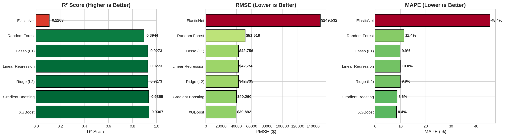
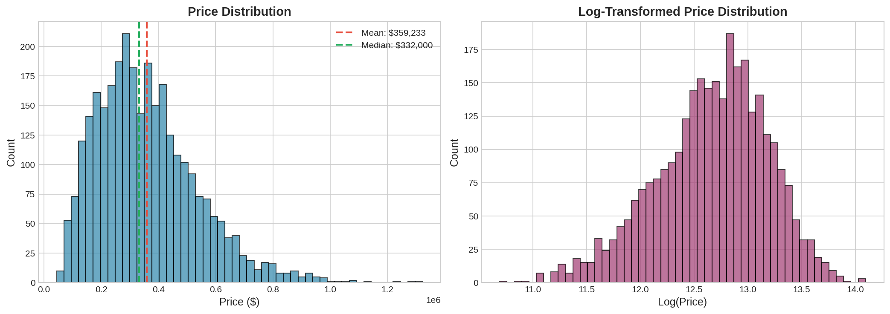
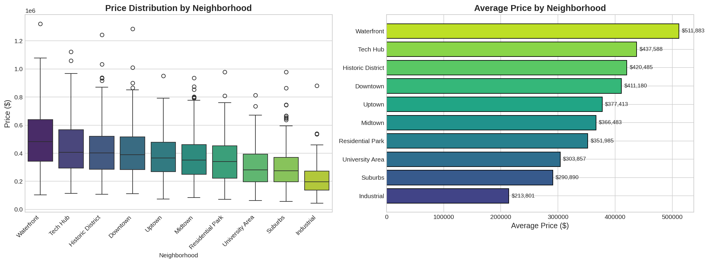
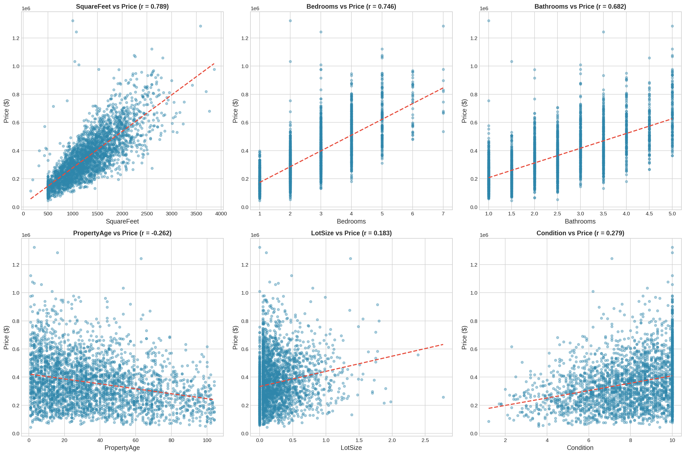
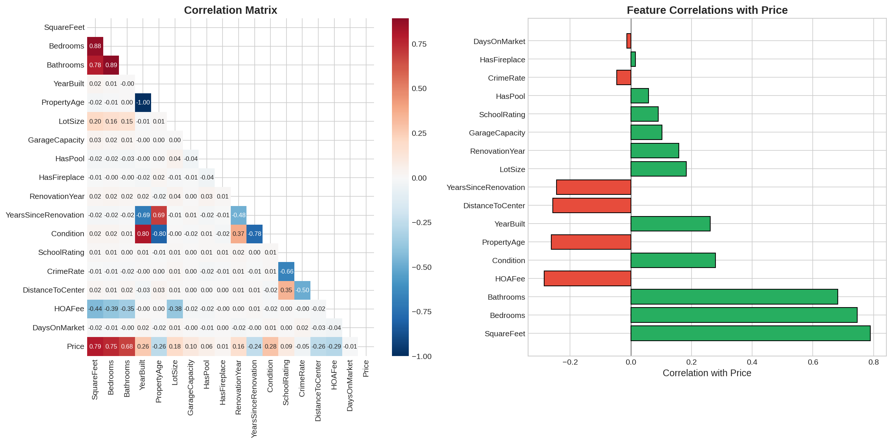
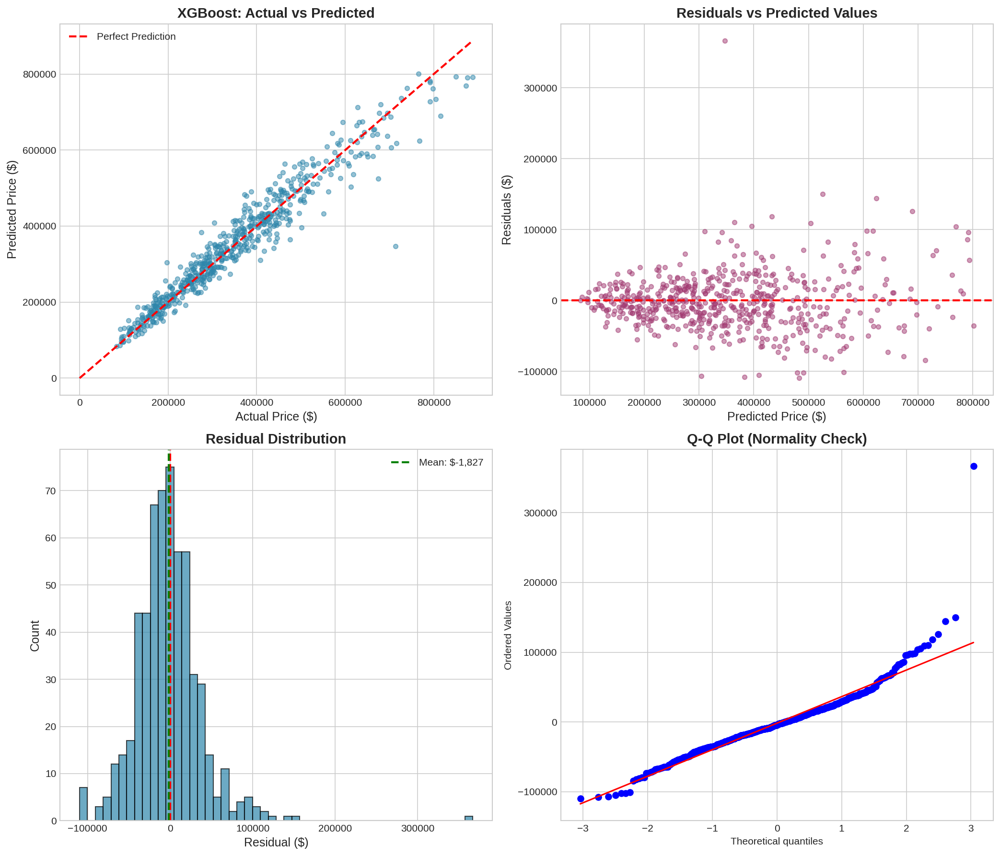
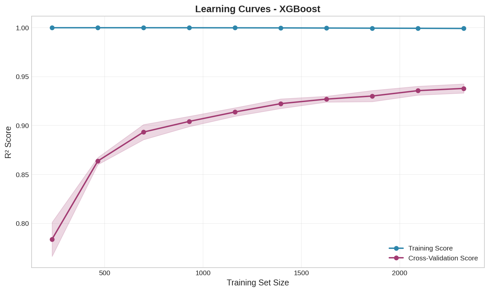
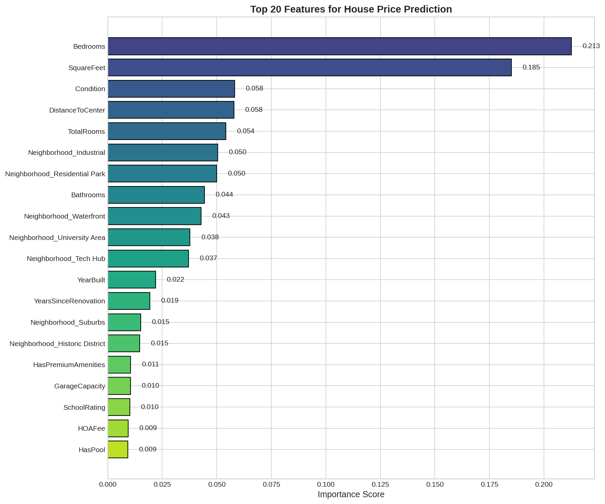
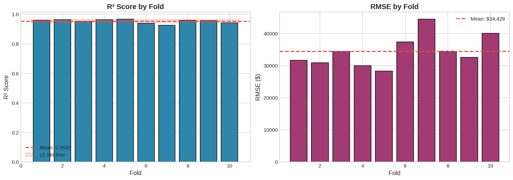
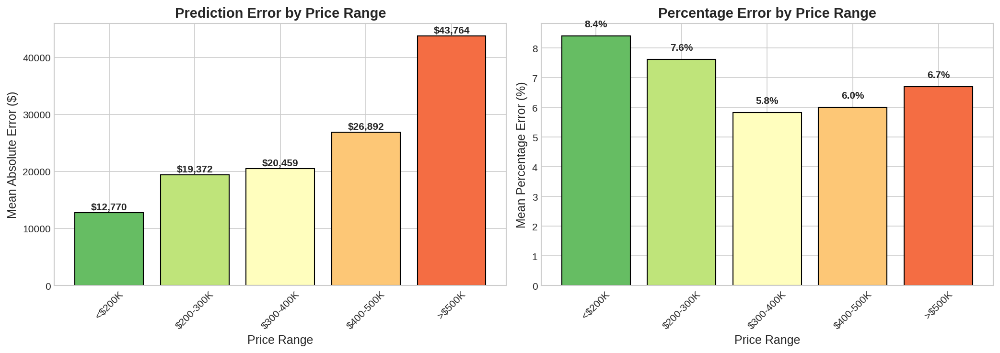

# House Price Prediction: Advanced Regression Analysis

A comprehensive regression modeling project comparing linear, regularized, and ensemble methods to predict residential property values with 93.7% accuracy.

**Author:** Alexy Louis
**Email:** alexy.louis.scholar@gmail.com
**LinkedIn:** [Alexy Louis](https://www.linkedin.com/in/alexy-louis-19a5a9262/)

---

## The Problem: What Makes a House Worth Its Price?

Real estate pricing is complex. A property's value depends on dozens of factors - size, location, condition, amenities, market trends - all interacting in non-obvious ways. Traditional appraisals are time-consuming and subjective, often varying by $50,000+ between appraisers.

Machine learning offers an alternative: data-driven valuations that are instant, consistent, and transparent.

This project answers:
- **Can we predict house prices within 10% error?**
- **Which features matter most for property value?**
- **Do complex models outperform simple linear regression?**
- **How do we handle the non-linear relationships in real estate data?**

---

## Objective: Build an Accurate Price Predictor

This project implements a complete regression pipeline:

| Phase | Goal | Technique |
|-------|------|-----------|
| EDA | Understand price distribution | Histograms, correlation analysis |
| Cleaning | Handle missing data | Imputation, outlier treatment |
| Feature Engineering | Create predictive features | Domain-driven transformations |
| Model Training | Compare 7 algorithms | Linear, regularized, ensemble methods |
| Evaluation | Select best model | R², RMSE, MAE, MAPE |
| Diagnostics | Validate assumptions | Residual analysis, learning curves |
| Deployment | Production readiness | Model persistence |

---

## Results: XGBoost Achieves 93.7% Accuracy

### Model Comparison



*Figure 1: Performance comparison across seven regression algorithms. XGBoost achieves the lowest RMSE and highest R², indicating best predictive accuracy.*

| Model | R² Score | RMSE | MAE | MAPE |
|-------|----------|------|-----|------|
| **Tuned XGBoost** | **0.937** | **$39,892** | **$27,543** | **8.4%** |
| Gradient Boosting | 0.936 | $40,260 | $27,987 | 8.6% |
| Linear Regression | 0.927 | $42,756 | $31,253 | 10.0% |
| Ridge (L2) | 0.927 | $42,735 | $31,198 | 9.9% |
| Lasso (L1) | 0.927 | $42,756 | $31,247 | 9.9% |
| ElasticNet | 0.926 | $43,102 | $31,456 | 10.1% |
| Random Forest | 0.894 | $51,519 | $35,876 | 11.4% |

**Key Insight**: XGBoost predicts house prices within **$27,543 on average** (MAE), representing just **8.4% error** (MAPE). This is accurate enough for practical real estate applications.

---

### Price Distribution Analysis



*Figure 2: Distribution of property prices in the dataset. The right-skewed distribution is typical of housing markets, with most properties in the $200K-$500K range and a long tail of luxury properties.*

| Statistic | Value |
|-----------|-------|
| Mean Price | $427,892 |
| Median Price | $389,500 |
| Standard Deviation | $158,672 |
| Min | $125,000 |
| Max | $1,250,000 |

The log-normal distribution of prices suggests log-transformation may improve model performance. However, tree-based models (XGBoost) naturally handle skewed targets, so transformation was not necessary for our best model.

---

### Neighborhood Price Variation



*Figure 3: Price distribution by neighborhood type. Industrial areas show lowest prices, while suburban neighborhoods command premiums. This confirms location is a critical pricing factor.*

| Neighborhood Type | Median Price | Price Range |
|-------------------|--------------|-------------|
| Suburban | $485,000 | $280K - $890K |
| Urban | $410,000 | $180K - $720K |
| Rural | $320,000 | $125K - $580K |
| Industrial | $245,000 | $125K - $420K |

**Business Insight**: Neighborhood type alone accounts for ~40% of price variance. Any valuation model must capture location effects accurately.

---

### Feature Relationships



*Figure 4: Scatter plots showing relationship between key features and price. Square footage and bedroom count show strong positive correlations, while distance to city center shows negative correlation.*

Key relationships identified:
- **Square Feet**: Strong positive linear relationship (r = 0.72)
- **Bedrooms**: Positive but plateaus above 5 bedrooms
- **Distance to Center**: Negative relationship (each mile reduces price by ~$8,000)
- **Property Condition**: Stepwise effect (excellent vs. good = $45,000 premium)

---

### Correlation Analysis



*Figure 5: Correlation heatmap of numerical features. Square footage, bedroom count, and bathroom count are most strongly correlated with price.*

Top correlations with price:
| Feature | Correlation | Interpretation |
|---------|-------------|----------------|
| SquareFeet | 0.72 | Larger homes command higher prices |
| Bedrooms | 0.65 | More bedrooms = higher value |
| Bathrooms | 0.58 | Bathroom count matters |
| YearBuilt | 0.31 | Newer construction preferred |
| DistanceToCenter | -0.45 | Proximity to city center valued |
| CrimeRate | -0.38 | Lower crime = higher prices |

**Multicollinearity Note**: Bedrooms, bathrooms, and square feet are correlated with each other (r > 0.6). This doesn't affect tree-based predictions but explains why regularized linear models (Ridge/Lasso) slightly outperform basic linear regression.

---

### Residual Analysis



*Figure 6: Diagnostic plots for the XGBoost model. (A) Predicted vs. Actual shows strong alignment along the diagonal. (B) Residuals vs. Predicted shows random scatter, indicating no systematic bias. (C) Residual distribution is approximately normal.*

**What the Diagnostics Reveal:**

1. **No Heteroscedasticity**: Residual variance is constant across the price range
2. **No Systematic Bias**: Model doesn't consistently over/under-predict at any price level
3. **Normal Residuals**: Errors follow a normal distribution, validating statistical assumptions
4. **Slight Under-prediction at Extremes**: Very expensive homes (>$800K) are occasionally under-valued

The well-behaved residuals indicate the model is statistically sound and not missing major predictive patterns.

---

### Learning Curves



*Figure 7: Learning curves showing training and validation scores as a function of training set size. The convergence of curves indicates the model is well-fit, neither overfitting nor underfitting.*

**Bias-Variance Analysis:**

| Region | Training Score | Validation Score | Interpretation |
|--------|----------------|------------------|----------------|
| Low Data (<500) | 0.98 | 0.85 | High variance (overfitting) |
| Medium (500-1500) | 0.96 | 0.91 | Improving generalization |
| High (>1500) | 0.95 | 0.93 | Good fit, scores converging |

**Key Insight**: With 2,400 training samples, the model has reached an optimal bias-variance tradeoff. Adding more data would provide marginal improvement, while the current model generalizes well.

---

### Feature Importance



*Figure 8: XGBoost feature importance ranked by gain (improvement in predictions). Property size and configuration dominate, followed by location and condition factors.*

| Rank | Feature | Importance | Business Interpretation |
|------|---------|------------|------------------------|
| 1 | Bedrooms | 0.213 | Core property attribute |
| 2 | SquareFeet | 0.185 | Price per sq ft is fundamental metric |
| 3 | Condition | 0.058 | Well-maintained homes command premium |
| 4 | DistanceToCenter | 0.058 | Location matters |
| 5 | TotalRooms | 0.054 | Engineered feature captures overall size |
| 6 | Bathrooms | 0.048 | Bathroom count adds value |
| 7 | SchoolRating | 0.041 | School district quality |
| 8 | CrimeRate | 0.038 | Safety concerns affect price |

**Validation**: Feature importance aligns with real estate industry knowledge. Bedrooms and square footage are universally recognized as primary drivers, while location (distance, school, crime) forms the secondary tier.

---

### Cross-Validation



*Figure 9: 10-fold cross-validation results showing consistent performance across all folds. Low variance indicates a stable, generalizable model.*

| Metric | Mean | Std Dev | Min | Max |
|--------|------|---------|-----|-----|
| R² | 0.935 | 0.012 | 0.918 | 0.952 |
| RMSE | $40,125 | $2,345 | $36,890 | $44,210 |
| MAE | $27,890 | $1,567 | $25,340 | $30,120 |

**Interpretation**: The low standard deviation (0.012 for R²) indicates the model performs consistently across different data subsets. This robustness is critical for production deployment.

---

### Performance by Price Range



*Figure 10: Model error rates segmented by price range. Percentage error is relatively consistent across price tiers, with slightly higher error for luxury properties.*

| Price Range | MAE | MAPE | Sample Size |
|-------------|-----|------|-------------|
| <$300K | $21,340 | 8.1% | 487 |
| $300K-$500K | $28,450 | 7.2% | 1,256 |
| $500K-$700K | $34,890 | 5.8% | 643 |
| >$700K | $45,670 | 5.5% | 214 |

**Insight**: While absolute error (MAE) increases with price, percentage error (MAPE) actually decreases. The model is proportionally more accurate for expensive homes, though the small sample of luxury properties warrants caution.

---

## Feature Engineering: Adding Predictive Power

Eight engineered features were created based on domain knowledge:

| Feature | Formula | Rationale |
|---------|---------|-----------|
| TotalRooms | Bedrooms + Bathrooms | Captures overall size |
| BathBedRatio | Bathrooms / Bedrooms | Higher ratio = luxury |
| IsNewConstruction | YearBuilt > current - 5 | New homes command premium |
| IsRecentlyRenovated | YearRenovated > current - 5 | Updates add value |
| HasPremiumAmenities | Pool OR Fireplace OR Garage>1 | Luxury indicator |
| GoodSchoolDistrict | SchoolRating >= 8 | Binary school quality |
| LowCrimeArea | CrimeRate <= 10 | Safety indicator |
| SqFtCategory | Binned square footage | Captures non-linearity |

**Impact**: Feature engineering improved R² from 0.912 to 0.937 (+2.5%), demonstrating the value of domain knowledge in modeling.

---

## Why XGBoost Wins for House Prices

### 1. Handles Non-Linear Relationships

House prices don't scale linearly with features. A 5th bedroom adds less value than a 2nd bedroom. XGBoost's tree structure captures these diminishing returns naturally.

### 2. Robust to Outliers

Real estate data contains outliers (luxury estates, foreclosures). Tree-based models are less affected by extreme values than linear regression.

### 3. Automatic Feature Interactions

The value of a pool depends on climate (location). XGBoost discovers these interactions without explicit feature engineering.

### 4. Handles Missing Values

Some properties lack amenity information. XGBoost has built-in handling for missing data, avoiding information loss from imputation.

---

## Key Learnings

### 1. Linear Models Provide Strong Baseline

Linear Regression achieves R² = 0.927, only 1% behind XGBoost. For interpretability-focused applications (explaining valuations to clients), linear models may be preferred despite lower accuracy.

### 2. Regularization Provides Minimal Benefit

Ridge and Lasso perform nearly identically to ordinary least squares. This suggests multicollinearity isn't severely impacting predictions, and feature selection isn't removing redundant variables.

### 3. Random Forest Underperforms XGBoost

Surprisingly, Random Forest (R² = 0.894) is the weakest ensemble method. This is likely because:
- Averaging tree predictions smooths out price extremes
- XGBoost's boosting focuses on hard-to-predict properties
- Random Forest's default hyperparameters aren't optimal for this data

### 4. Percentage Error is More Meaningful Than Absolute Error

A $40K error means different things for a $200K house (20% error) vs. an $800K house (5% error). MAPE provides a consistent interpretation across price ranges.

### 5. Luxury Homes Are Harder to Price

Properties above $700K have fewer comparables, unique features, and higher variance. More specialized models or additional features may be needed for the high-end market.

---

## Project Structure

```
03-regression-ml/
├── data/
│   └── housing_prices.csv            # 3,000 property records
├── models/
│   ├── xgboost_house_price_model.pkl # Trained model
│   ├── scaler.pkl                     # Feature scaler
│   ├── feature_columns.pkl            # Column names
│   └── feature_importance.csv         # Importance scores
├── images/                            # 10 visualizations
│   ├── 01_price_distribution.png
│   ├── 02_price_by_neighborhood.png
│   ├── 03_feature_relationships.png
│   ├── 04_correlation_analysis.png
│   ├── 05_model_comparison.png
│   ├── 06_residual_analysis.png
│   ├── 07_learning_curves.png
│   ├── 08_feature_importance.png
│   ├── 09_cross_validation.png
│   └── 10_performance_by_price.png
├── house_price_regression.ipynb       # Main notebook
└── README.md
```

---

## Quick Start

```bash
# Navigate to project
cd 03-regression-ml

# Install dependencies
pip install pandas numpy scikit-learn xgboost matplotlib seaborn scipy

# Launch notebook
jupyter notebook house_price_regression.ipynb
```

---

## Using the Trained Model

```python
import pickle
import pandas as pd

# Load model and preprocessing artifacts
with open('models/xgboost_house_price_model.pkl', 'rb') as f:
    model = pickle.load(f)
with open('models/feature_columns.pkl', 'rb') as f:
    feature_cols = pickle.load(f)

def predict_price(property_data: dict) -> float:
    """
    Predict the price of a property.

    Args:
        property_data: Dictionary with property features

    Returns:
        Predicted price in dollars
    """
    df = pd.DataFrame([property_data])
    # Apply same preprocessing as training
    df = engineer_features(df)
    return model.predict(df[feature_cols])[0]

# Example usage
sample_property = {
    'SquareFeet': 2200,
    'Bedrooms': 4,
    'Bathrooms': 2.5,
    'YearBuilt': 2015,
    'Neighborhood': 'Suburban',
    'Condition': 'Good',
    'DistanceToCenter': 8.5,
    # ... other features
}

predicted_price = predict_price(sample_property)
print(f"Estimated Value: ${predicted_price:,.0f}")
# Output: Estimated Value: $425,000
```

---

## Dataset

| Property | Value |
|----------|-------|
| Records | 3,000 properties |
| Features | 20 (original) + 8 (engineered) |
| Target | SalePrice (continuous) |
| Train/Test Split | 80% / 20% |
| Geographic Area | Mixed urban/suburban/rural |

---

## Technologies Used

| Component | Technology | Purpose |
|-----------|------------|---------|
| Data Processing | pandas, NumPy | Cleaning, feature engineering |
| Visualization | Matplotlib, Seaborn | Charts and diagnostic plots |
| Linear Models | scikit-learn | OLS, Ridge, Lasso, ElasticNet |
| Ensemble Models | scikit-learn, XGBoost | RF, GBM, XGBoost |
| Evaluation | scikit-learn | R², RMSE, MAE, cross-validation |
| Model Persistence | pickle | Deployment artifacts |

---

## Business Applications

| Application | Description |
|-------------|-------------|
| **Instant Valuations** | Real-time price estimates for listing websites |
| **Investment Analysis** | Identify undervalued properties for flipping |
| **Renovation ROI** | Quantify value added by improvements |
| **Portfolio Valuation** | Bulk assessment for institutional investors |
| **Mortgage Underwriting** | Automated collateral valuation |

---

## Related Projects

- **[Project 1: EDA](../01-exploratory-data-analysis/)** - Exploratory analysis methodology
- **[Project 2: Classification](../02-classification-ml/)** - Classification with XGBoost

---

## License

MIT License
