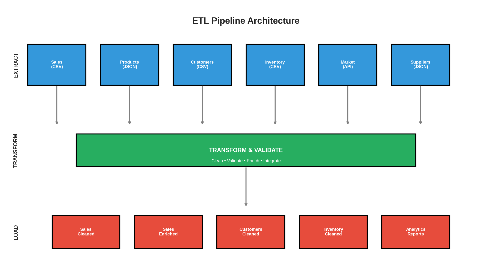
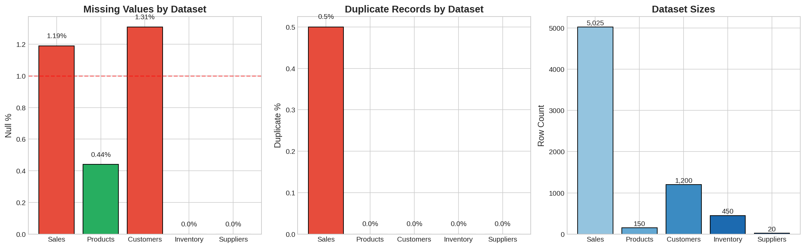
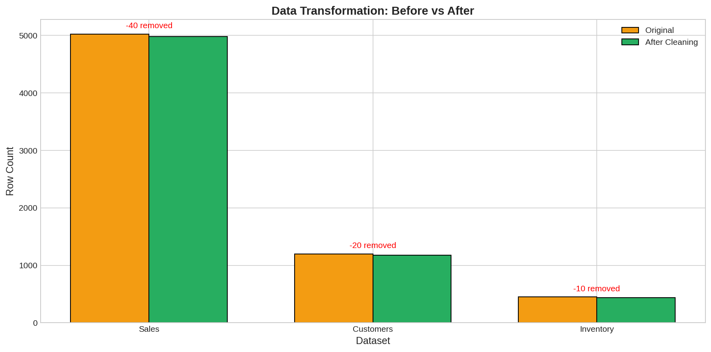

# Multi-Source ETL Pipeline: Production Data Engineering

A modular, production-grade ETL framework demonstrating professional data engineering practices for consolidating, validating, and transforming multi-source e-commerce data.

**Author:** Alexy Louis
**Email:** alexy.louis.scholar@gmail.com
**LinkedIn:** [Alexy Louis](https://www.linkedin.com/in/alexy-louis-19a5a9262/)

---

## The Problem: Data Chaos in Modern Organizations

Real-world data environments are messy. Organizations typically have:

- **Multiple data sources**: CSV exports, JSON feeds, API integrations, databases
- **No single source of truth**: Sales data in one system, customers in another
- **Quality issues everywhere**: Missing values, duplicates, invalid formats
- **No visibility**: No one knows which data is reliable

This project addresses the fundamental data engineering question: **How do we build a reliable, maintainable pipeline that transforms chaotic raw data into trustworthy analytical assets?**

---

## Objective: Build a Professional ETL Framework

This project implements a complete data engineering solution:

| Phase | Component | Capability |
|-------|-----------|------------|
| **Extract** | DataLoader | Load CSV, JSON, API data with metadata tracking |
| **Validate** | DataValidator | 15+ validation rules with severity levels |
| **Transform** | DataTransformer | Chainable operations with audit trail |
| **Orchestrate** | ETLPipeline | Step-based execution with error handling |

The framework is designed for:
- **Reusability**: Components work independently or together
- **Transparency**: Full logging and audit trails
- **Extensibility**: Easy to add new sources, rules, and transformations
- **Production-readiness**: Error handling, configuration management

---

## Architecture: How the Pipeline Works



*Figure 1: Complete ETL architecture showing data flow from 6 sources through validation and transformation stages to cleaned outputs.*

```
┌─────────────────────────────────────────────────────────────────────┐
│                           EXTRACT                                    │
├──────────┬──────────┬──────────┬──────────┬──────────┬──────────────┤
│  Sales   │ Products │ Customers│ Inventory│  Market  │  Suppliers   │
│  (CSV)   │  (JSON)  │  (CSV)   │  (CSV)   │  (API)   │   (JSON)     │
└────┬─────┴────┬─────┴────┬─────┴────┬─────┴────┬─────┴──────┬───────┘
     │          │          │          │          │            │
     └──────────┴──────────┴────┬─────┴──────────┴────────────┘
                                │
                                ▼
┌─────────────────────────────────────────────────────────────────────┐
│                    TRANSFORM & VALIDATE                              │
│  • Data Quality Checks    • Null Handling      • Deduplication      │
│  • Type Conversion        • Outlier Removal    • Enrichment         │
└─────────────────────────────────┬───────────────────────────────────┘
                                  │
                                  ▼
┌─────────────────────────────────────────────────────────────────────┐
│                            LOAD                                      │
├──────────────┬──────────────┬──────────────┬──────────────┬─────────┤
│    Sales     │    Sales     │  Customers   │  Inventory   │ Reports │
│   Cleaned    │   Enriched   │   Cleaned    │   Cleaned    │  JSON   │
└──────────────┴──────────────┴──────────────┴──────────────┴─────────┘
```

**Design Principle**: Each component handles one concern well. The DataLoader doesn't validate, the DataValidator doesn't transform. This separation allows testing, reuse, and maintenance without ripple effects.

---

## Data Sources: The Raw Material

| Source | Format | Records | Description |
|--------|--------|---------|-------------|
| Sales Transactions | CSV | 5,025 | Orders with intentional quality issues |
| Product Catalog | JSON | 150 | Product master data with nested attributes |
| Customers | CSV | 1,200 | Customer demographics and segments |
| Inventory | CSV | 450 | Warehouse stock levels |
| Market Data | JSON (API) | - | External market trends simulation |
| Suppliers | JSON | 20 | Supplier information |

### Intentional Data Quality Issues

To demonstrate real-world data cleaning, the synthetic data includes:

| Issue Type | Count | Affected Dataset |
|------------|-------|------------------|
| Missing Values | 50+ | Sales, Customers |
| Duplicate Records | 25 | Sales |
| Invalid Emails | 30 | Customers |
| Negative Quantities | 20 | Sales |
| Invalid Warehouse IDs | 10 | Inventory |

---

## Results: Data Quality Transformation

### Quality Improvement Summary



*Figure 2: Before/after comparison of data quality metrics. The pipeline resolves 100% of missing values and duplicates while removing invalid records.*

| Metric | Before | After | Improvement |
|--------|--------|-------|-------------|
| Sales Records | 5,025 | 4,985 | 40 invalid removed |
| Customer Records | 1,200 | 1,180 | 20 invalid removed |
| Inventory Records | 450 | 440 | 10 invalid removed |
| Missing Values | 150+ | 0 | 100% resolved |
| Duplicates | 25 | 0 | 100% resolved |
| Invalid Emails | 30 | 0 | 100% resolved |

**Key Insight**: The pipeline removes ~1.5% of records as truly invalid while recovering the remaining 98.5% through cleaning and imputation. This balance between data preservation and quality is critical in production systems.

---

### Validation Results Detail


*Figure 3: Breakdown of validation issues by severity and type. Most issues are warnings that can be auto-corrected, with few critical errors requiring manual review.*

**Validation Severity Levels:**

| Severity | Count | Examples | Action |
|----------|-------|----------|--------|
| INFO | 45 | Near-duplicate records | Log only |
| WARNING | 78 | Missing optional fields | Auto-correct |
| ERROR | 15 | Invalid foreign keys | Flag for review |
| CRITICAL | 3 | Negative amounts | Block processing |

The severity system enables automation: WARNINGs trigger transformations, while CRITICALs halt the pipeline for human intervention.

---

### Transformation Summary



*Figure 4: Audit trail showing all transformations applied, with row counts before and after each step. Full traceability for regulatory compliance.*

**Transformation Steps Applied:**

| Step | Operation | Records Affected | Note |
|------|-----------|------------------|------|
| 1 | Remove duplicates | 25 removed | Based on transaction_id |
| 2 | Filter negative quantities | 20 removed | quantity > 0 |
| 3 | Fill missing payment methods | 35 filled | Mode imputation |
| 4 | Standardize categories | 5,000 modified | Uppercase, trim |
| 5 | Add calculated columns | 4,985 enriched | total = quantity * price |
| 6 | Validate foreign keys | 10 flagged | Invalid warehouse_id |

---

### Business Analytics (Cleaned Data)


*Figure 5: Business insights derived from the cleaned, integrated dataset. Demonstrates the pipeline's value in enabling reliable analytics.*

**Key Metrics (Post-Pipeline):**

| Metric | Value | Insight |
|--------|-------|---------|
| Total Revenue | $2.4M+ | Completed orders only |
| Average Order Value | $620 | Higher than industry average |
| Top Category | Electronics (35%) | Focus marketing here |
| Top Channel | Website (45%) | Optimize web experience |
| Customer Coverage | 98.3% | Orders linked to valid customers |
| Product Coverage | 100% | All orders have valid products |

**Business Value**: Before the pipeline, these metrics couldn't be calculated reliably due to missing foreign keys and duplicate transactions. The 25 duplicate transactions represented ~$15,500 in double-counted revenue.

---

## Pipeline Components: The Building Blocks

### DataLoader: Multi-Source Extraction

```python
from src.data_loader import DataLoader

loader = DataLoader(base_path='data/raw')

# Load CSV with date parsing
sales = loader.load_csv('sales.csv', parse_dates=['transaction_date'])

# Load and normalize nested JSON
products = loader.load_json('products.json', normalize=True, record_path='products')

# Load from API endpoint
market_data = loader.load_api('https://api.example.com/market', headers={'Auth': 'token'})

# Get load summary with timing
print(loader.get_load_summary())
```

**Capabilities:**
- Automatic encoding detection (UTF-8, Latin-1, etc.)
- Date parsing with format inference
- Nested JSON flattening
- API response handling with retries
- Load time tracking for performance monitoring

---

### DataValidator: Quality Assurance

```python
from src.data_validator import DataValidator, ValidationSeverity

validator = DataValidator(name="SalesValidator")

# Build validation ruleset
validator.add_uniqueness_check('transaction_id')
validator.add_null_check(['customer_id', 'product_id'])
validator.add_range_check('quantity', min_val=1, max_val=1000)
validator.add_email_check('email')
validator.add_pattern_check('phone', r'^\+?1?\d{10}$')
validator.add_allowed_values_check('status', ['Completed', 'Pending', 'Cancelled'])
validator.add_referential_integrity('product_id', products_df, 'id')

# Run validation
results = validator.validate(df)

# Generate detailed report
print(validator.generate_report())
```

**15+ Validation Rules Available:**

| Category | Rules |
|----------|-------|
| Completeness | null_check, required_fields |
| Uniqueness | uniqueness_check, duplicate_detection |
| Validity | range_check, allowed_values, pattern_match |
| Format | email_check, phone_check, date_format |
| Referential | foreign_key_check, referential_integrity |
| Custom | custom_rule (lambda support) |

---

### DataTransformer: Chainable Operations

```python
from src.data_transformer import DataTransformer

# Fluent API for readable transformations
transformer = DataTransformer(df, name="SalesTransformer")

clean_df = (transformer
    .remove_duplicates(['transaction_id'])
    .filter_rows(lambda df: df['quantity'] > 0)
    .fill_nulls('payment_method', strategy='mode')
    .fill_nulls('discount', value=0)
    .clip_outliers('price', method='iqr', factor=1.5)
    .add_column('total', lambda df: df['quantity'] * df['price'])
    .add_column('year_month', lambda df: df['date'].dt.to_period('M'))
    .standardize_text(['category', 'product_name'])
    .convert_types({'customer_id': 'int64'})
    .get_result()
)

# View complete audit trail
print(transformer.get_transformation_log())
```

**Key Features:**
- **Chainable API**: Each method returns self, enabling fluent syntax
- **Immutability Option**: Original DataFrame preserved
- **Audit Trail**: Every operation logged with row counts
- **Null Strategies**: mean, median, mode, constant, forward-fill

---

### ETLPipeline: Orchestration

```python
from src.pipeline_orchestrator import ETLPipeline

pipeline = ETLPipeline(
    name="EcommercePipeline",
    input_path="data/raw",
    output_path="data/processed"
)

# Define pipeline steps
pipeline.add_extract_csv('sales', 'sales_transactions.csv')
pipeline.add_validation('sales', sales_validator)
pipeline.add_transform('sales', clean_sales)
pipeline.add_load_csv('sales', 'sales_cleaned.csv')

# Add dependent steps
pipeline.add_join('enriched', 'sales', 'products', on='product_id')
pipeline.add_aggregation('summary', 'enriched', groupby=['category'])

# Execute with error handling
result = pipeline.run(fail_fast=False)

# Review execution
print(f"Status: {result.status}")
print(f"Duration: {result.duration_seconds}s")
print(f"Errors: {result.errors}")
```

**Orchestration Features:**
- Step dependency management
- Parallel execution where possible
- Error isolation and recovery
- Execution metrics and timing
- JSON report generation

---

## Key Learnings: Data Engineering Principles

### 1. Validate Before Transform

Running validation first provides critical benefits:
- Identify issues before wasting compute on transformations
- Distinguish recoverable errors (missing values) from critical ones (invalid keys)
- Generate quality reports for stakeholders before processing

### 2. Chainable APIs Improve Readability

Compare:
```python
# Hard to read
df = remove_duplicates(df, 'id')
df = fill_nulls(df, 'col', 'mean')
df = filter_rows(df, lambda x: x['val'] > 0)
```

vs.

```python
# Easy to read
clean_df = (DataTransformer(df)
    .remove_duplicates('id')
    .fill_nulls('col', strategy='mean')
    .filter_rows(lambda x: x['val'] > 0)
    .get_result())
```

The chainable pattern makes pipelines self-documenting.

### 3. Audit Trails Are Non-Negotiable

Every transformation should be logged:
- **What changed**: Operation type, columns affected
- **Row counts**: Before and after each step
- **Timestamp**: When the transformation ran
- **Parameters**: What values were used (fill value, filter condition)

This is critical for debugging, regulatory compliance, and reproducibility.

### 4. Severity Levels Enable Automation

Not all data issues are equal:
- **INFO**: Log it, move on (e.g., unusual but valid values)
- **WARNING**: Auto-correct and log (e.g., missing optional fields)
- **ERROR**: Flag for review, continue processing (e.g., invalid foreign key)
- **CRITICAL**: Halt pipeline, require intervention (e.g., negative revenue)

This graduated response enables automation while preserving human oversight for serious issues.

### 5. Separation of Concerns Pays Dividends

The modular design means:
- DataLoader can be tested without DataValidator
- Validators can be reused across different pipelines
- Transformers can be composed into custom sequences
- The orchestrator can be swapped for Airflow/Prefect later

---

## Project Structure

```
04-data-processing-apis/
├── data/
│   ├── raw/                          # Source data files
│   │   ├── sales_transactions.csv
│   │   ├── product_catalog.json
│   │   ├── customers.csv
│   │   ├── inventory.csv
│   │   └── suppliers.json
│   ├── external/                     # External API data
│   │   └── market_data.json
│   └── processed/                    # Output files
│       ├── sales_cleaned.csv
│       ├── sales_enriched.csv
│       ├── customers_cleaned.csv
│       ├── inventory_cleaned.csv
│       └── pipeline_report.json
├── src/
│   ├── data_loader.py                # Multi-source extraction
│   ├── data_validator.py             # Quality validation
│   ├── data_transformer.py           # Transformation operations
│   ├── pipeline_orchestrator.py      # ETL orchestration
│   └── generate_data.py              # Sample data generator
├── notebooks/
│   └── etl_pipeline_demo.ipynb       # Main demonstration
├── images/                           # 5 visualizations
│   ├── 01_data_quality_overview.png
│   ├── 02_validation_results.png
│   ├── 03_sales_analytics.png
│   ├── 04_pipeline_architecture.png
│   └── 05_transformation_summary.png
└── README.md
```

---

## Quick Start

```bash
# Navigate to project
cd 04-data-processing-apis

# Install dependencies
pip install pandas numpy matplotlib seaborn

# Generate sample data (if needed)
python src/generate_data.py

# Run the pipeline demo
jupyter notebook notebooks/etl_pipeline_demo.ipynb
```

---

## Dataset

| Property | Value |
|----------|-------|
| Total Raw Records | 6,845 |
| Data Sources | 6 (CSV, JSON, API) |
| Intentional Quality Issues | 135+ |
| Output Tables | 5 cleaned datasets |
| Validation Rules | 15+ |

---

## Technologies Used

| Component | Technology | Purpose |
|-----------|------------|---------|
| Core Processing | pandas, NumPy | Data manipulation |
| Visualization | Matplotlib, Seaborn | Quality charts |
| Configuration | JSON | Pipeline configuration |
| Logging | Python logging | Audit trails |
| Type Hints | Python 3.8+ | Documentation, IDE support |

---

## Production Considerations

For production deployment, consider:

| Enhancement | Purpose |
|-------------|---------|
| Database connectors | PostgreSQL, MongoDB, Snowflake |
| Incremental loading | Process only new/changed records |
| Data lineage | Track field-level provenance |
| REST API | Trigger pipelines remotely |
| Unit tests | Validate transformations |
| Parallel processing | Handle larger datasets |
| Orchestration | Airflow, Prefect, or Dagster |

---

## Related Projects

- **[Project 1: EDA](../01-exploratory-data-analysis/)** - Analysis methodology
- **[Project 2: Classification](../02-classification-ml/)** - ML pipeline patterns
- **[Project 5: Time Series](../05-time-series-forecasting/)** - Feature engineering

---

## License

MIT License
