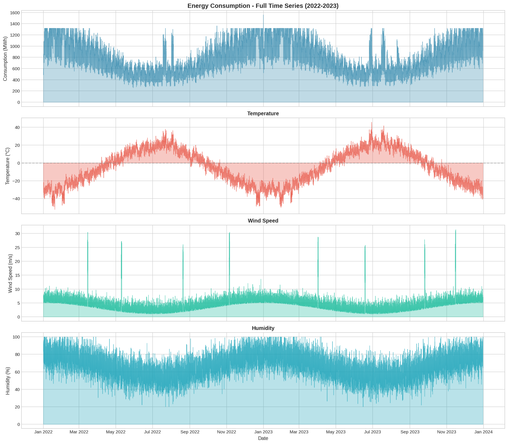
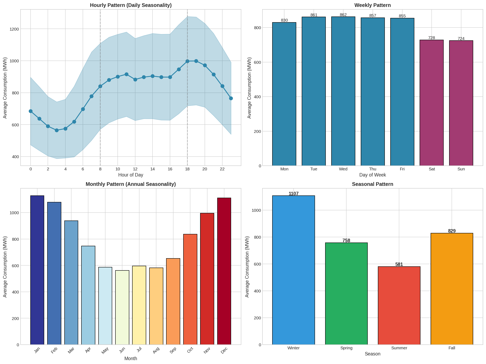
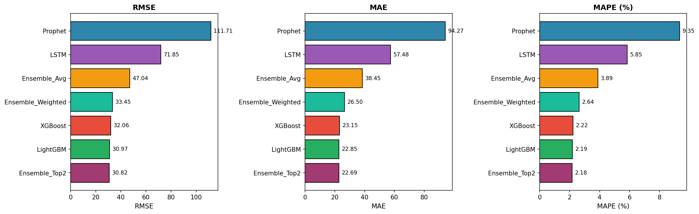
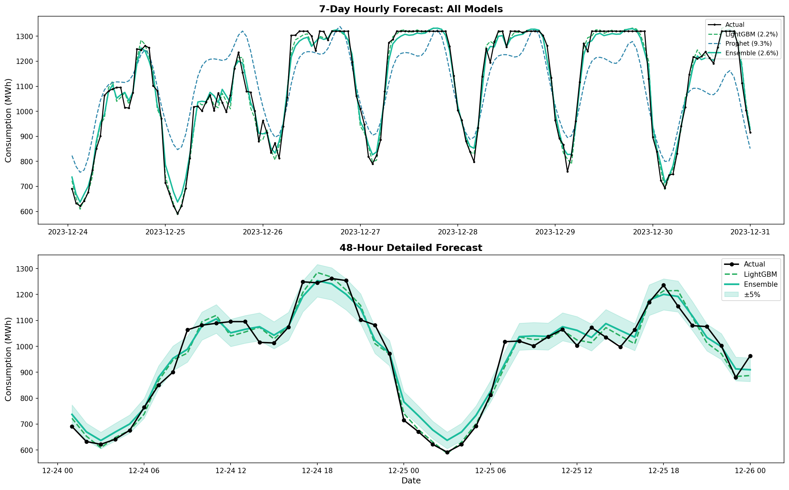

# ⚡ Energy Consumption Forecasting

**Production-Grade Time Series Analysis & Forecasting System**

[](https://www.python.org/)
[](https://tensorflow.org/)
[](https://scikit-learn.org/)

## 📋 Executive Summary

This project demonstrates comprehensive time series forecasting capabilities using **2 years of hourly energy consumption data** (17,500+ records) with weather integration, extreme event modeling, and anomaly detection.

### 🏆 Key Results

| Metric | Value |
|--------|-------|
| **Best Model** | Ensemble (LightGBM + XGBoost) |
| **MAPE** | **2.18%** |
| **RMSE** | 30.82 MWh |
| **Forecast Horizon** | 7 days (168 hours) |

### 🎯 Business Impact

- **Grid Load Balancing**: Accurate demand forecasting enables optimal resource allocation
- **Cost Optimization**: 2.18% error rate translates to significant operational savings
- **Extreme Weather Preparedness**: Models account for heat waves, cold snaps, and storms
- **Anomaly Detection**: 51% recall on detecting equipment failures and special events

---

## 📊 Dataset Overview

### Simulated Energy Consumption Data
- **Location**: Chicago, IL (Midwest US - excellent seasonal variation)
- **Period**: January 2022 - December 2023 (2 years)
- **Frequency**: Hourly (17,497 records)
- **Features**: 46 original + 138 engineered = **184 total features**

### Data Sources Integrated

| Source | Features | Description |
|--------|----------|-------------|
| **Consumption** | 3 | MWh, per capita, load factor |
| **Weather** | 10 | Temperature, humidity, wind, clouds, precipitation, pressure, UV |
| **Calendar** | 14 | Hour, day, month, holidays, seasons, day types |
| **Solar** | 6 | Day length, sunrise/sunset, daylight status |
| **Extreme Events** | 4 | Heat waves, cold snaps, storms |
| **Anomalies** | 3 | Equipment failures, special events |

### Extreme Weather Events Modeled

```
Heat Waves:    629 hours (5 events)  → +35% consumption spike
Cold Snaps:    581 hours (5 events)  → +40% consumption spike  
Storms:        200 hours (8 events)  → -5% consumption (industrial shutdown)
```

---

## 🔬 Methodology

### 1. Exploratory Data Analysis
- Time series decomposition (trend, seasonality, residuals)
- Multiple seasonality identification (hourly, daily, weekly, annual)
- Temperature-consumption relationship analysis (U-shaped curve)
- Correlation analysis across 17 key features

### 2. Feature Engineering (138 Features)

| Category | Count | Examples |
|----------|-------|----------|
| Lag Features | 10 | 1h, 24h, 168h lags |
| Rolling Statistics | 27 | Mean, std, min, max, EWMA |
| Difference Features | 5 | Hourly/daily/weekly changes |
| Cyclical Encodings | 11 | Sin/cos for hour, day, month |
| Weather Interactions | 8 | Temp², wind chill, heat index |
| Target Encodings | 5 | Historical averages by hour/day |

### 3. Models Implemented

#### Classical Time Series
- ARIMA(2,1,2)
- SARIMA(1,1,1)(1,1,1,7) - weekly seasonality
- SARIMAX with weather regressors

#### Facebook Prophet
- Basic Prophet (automatic seasonality)
- Prophet + US Holidays
- Prophet + Weather Regressors

#### Machine Learning
- Ridge Regression (baseline)
- Random Forest (100 trees)
- XGBoost (200 estimators)
- LightGBM (200 estimators)

#### Deep Learning
- Simple LSTM (64 units)
- Stacked LSTM (128 → 64 units)
- Bidirectional LSTM

#### Ensemble Methods
- Simple Average
- Weighted Average (inverse MAPE)
- Top-2 Ensemble (LightGBM + XGBoost)

### 4. Anomaly Detection
- Statistical Methods (Z-score, IQR)
- Machine Learning (Isolation Forest)
- Prediction Residual Analysis
- Combined Ensemble Scoring

---

## 📈 Results

### Model Comparison

| Model | RMSE (MWh) | MAE (MWh) | MAPE (%) |
|-------|------------|-----------|----------|
| **Ensemble (Top 2)** | **30.82** | **22.69** | **2.18** |
| LightGBM | 30.97 | 22.85 | 2.19 |
| XGBoost | 32.06 | 23.15 | 2.22 |
| Ensemble (Weighted) | 33.45 | 26.50 | 2.64 |
| Random Forest | 40.10 | 26.71 | 2.63 |
| Ridge Regression | 46.25 | 36.84 | 3.48 |
| Simple LSTM | 39.71 | 29.27 | 2.83 |
| Prophet | 111.71 | 94.27 | 9.35 |
| SARIMA | 4,455 | 1,653 | 89.1 |

### Key Findings

1. **Tree-based ensemble models outperform all others** for this multi-seasonality data
2. **Lag features are critical** - consumption at same hour yesterday/last week are top predictors
3. **Classical models struggle** with multiple overlapping seasonalities
4. **Prophet excels at capturing seasonality** but underperforms on short-term accuracy
5. **LSTM competitive but computationally expensive** compared to gradient boosting

### Top 5 Most Important Features

1. `consumption_same_hour_yesterday` (24h lag)
2. `consumption_lag_1h`
3. `consumption_rolling_mean_24h`
4. `hour_avg_consumption` (target encoding)
5. `temperature_c`

---

## 📁 Project Structure

```
05-time-series-forecasting/
├── README.md                          # This file
├── PROGRESS.md                        # Development tracker
│
├── data/
│   ├── raw/
│   │   ├── energy_consumption.csv     # Main dataset (17,497 × 46)
│   │   ├── weather_data.csv           # Weather features
│   │   ├── calendar_data.csv          # Calendar features
│   │   ├── solar_data.csv             # Solar/daylight features
│   │   └── metadata.json              # Dataset documentation
│   │
│   ├── processed/
│   │   ├── energy_features_full.csv   # All 138 features
│   │   ├── energy_features_model.csv  # Model-ready dataset
│   │   ├── final_predictions.csv      # All model predictions
│   │   └── feature_list.json          # Feature categories
│   │
│   └── external/                      # External data sources
│
├── src/
│   ├── generate_data.py               # Synthetic data generator
│   └── feature_engineering.py         # Feature creation pipeline
│
├── notebooks/
│   └── energy_forecasting.ipynb       # Complete analysis notebook
│
├── models/
│   ├── lightgbm_model.pkl            # Best ML model
│   ├── xgboost_model.pkl             # XGBoost model
│   ├── prophet_weather_model.pkl     # Prophet model
│   ├── lstm_stacked.keras            # LSTM model
│   ├── final_model_comparison.csv    # All metrics
│   └── evaluation_summary.json       # Summary statistics
│
├── images/                            # 24 visualizations
│   ├── 01_time_series_overview.png
│   ├── 02_seasonality_analysis.png
│   ├── ...
│   └── 24_error_analysis.png
│
└── docs/                              # Additional documentation
```

---

## 🚀 Quick Start

### Prerequisites

```bash
pip install pandas numpy matplotlib seaborn scikit-learn
pip install statsmodels prophet tensorflow lightgbm xgboost
```

### Basic Usage

```python
import pandas as pd
import pickle

# Load data
df = pd.read_csv('data/processed/energy_features_model.csv')

# Load best model
model = pickle.load(open('models/lightgbm_model.pkl', 'rb'))

# Define features
features = ['consumption_lag_1h', 'consumption_lag_24h', 
            'temperature_c', 'hour_sin', 'hour_cos', ...]

# Make predictions
predictions = model.predict(df[features])
```

### Full Pipeline

```python
from src.feature_engineering import engineer_features
from src.generate_data import generate_energy_data

# Generate synthetic data
data = generate_energy_data(start='2022-01-01', end='2023-12-31')

# Engineer features
featured_data = engineer_features(data)

# Train model
from lightgbm import LGBMRegressor
model = LGBMRegressor(n_estimators=200, max_depth=8)
model.fit(X_train, y_train)

# Forecast
forecast = model.predict(X_future)
```

---

## 📊 Visualizations

### Time Series Overview


### Seasonality Analysis


### Model Comparison


### Forecast Results


---

## 🔮 Future Enhancements

1. **Real-time Prediction API** - Deploy as REST service
2. **Automated Retraining** - MLOps pipeline with drift detection
3. **Multi-step Forecasting** - Extend to 30-day horizons
4. **Probabilistic Forecasts** - Confidence intervals using quantile regression
5. **External Data Integration** - Real weather API, economic indicators

---

## 📚 References

- [Prophet Documentation](https://facebook.github.io/prophet/)
- [LightGBM Paper](https://papers.nips.cc/paper/6907-lightgbm-a-highly-efficient-gradient-boosting-decision-tree)
- [Time Series Forecasting with ML](https://otexts.com/fpp3/)

---

## 👤 Author

**Alexy Louis**

- 📧 Email: alexy.louis.scholar@gmail.com
- 💼 LinkedIn: [linkedin.com/in/alexy-louis-19a5a9262](https://www.linkedin.com/in/alexy-louis-19a5a9262/)
- 🐙 GitHub: [github.com/Smooth-Cactus0](https://github.com/Smooth-Cactus0)

---

## 📄 License

This project is part of a data analysis portfolio. Feel free to use for learning purposes.

---

*Built with ❤️ using Python, TensorFlow, LightGBM, and Prophet*
