# Energy Consumption Forecasting: Time Series Analysis

A comprehensive time series forecasting system comparing classical, machine learning, and deep learning approaches on 2 years of hourly energy data, achieving 2.18% MAPE with an ensemble of gradient boosting models.

**Author:** Alexy Louis
**Email:** alexy.louis.scholar@gmail.com
**LinkedIn:** [Alexy Louis](https://www.linkedin.com/in/alexy-louis-19a5a9262/)

---

## The Problem: Predicting Energy Demand

Accurate energy forecasting is critical for grid operators, utilities, and energy traders:

- **Grid Stability**: Over/under-supply causes blackouts or wasted generation
- **Cost Optimization**: Peak demand costs 2-10x base rates
- **Renewable Integration**: Solar/wind variability requires accurate demand prediction
- **Infrastructure Planning**: Forecasts drive billion-dollar capital investments

The challenge: Energy consumption exhibits **multiple overlapping seasonalities** (hourly, daily, weekly, annual) and is influenced by weather, holidays, and economic activity. No single model handles all these factors well.

This project answers: **Which forecasting approaches work best for complex time series with multiple seasonalities?**

---

## Objective: Compare Forecasting Approaches

This project implements a comprehensive forecasting system:

| Approach | Models | Strength |
|----------|--------|----------|
| **Classical** | ARIMA, SARIMA, SARIMAX | Interpretable, well-understood |
| **Statistical** | Prophet (Facebook) | Automatic seasonality, holidays |
| **Machine Learning** | Ridge, RF, XGBoost, LightGBM | Feature engineering, non-linearity |
| **Deep Learning** | LSTM, BiLSTM, Stacked LSTM | Sequence patterns, long memory |
| **Ensemble** | Weighted average, Top-2 | Combines strengths |

All models are evaluated on the same 7-day (168 hour) forecast horizon, enabling fair comparison.

---

## Results: Tree-Based Ensembles Dominate

### Model Comparison


*Figure 1: MAPE comparison across all model families. The LightGBM + XGBoost ensemble achieves the lowest error at 2.18%.*

| Model | RMSE (MWh) | MAE (MWh) | MAPE (%) | Training Time |
|-------|------------|-----------|----------|---------------|
| **Ensemble (Top 2)** | **30.82** | **22.69** | **2.18** | 45s |
| LightGBM | 30.97 | 22.85 | 2.19 | 20s |
| XGBoost | 32.06 | 23.15 | 2.22 | 25s |
| Ensemble (Weighted) | 33.45 | 26.50 | 2.64 | - |
| Random Forest | 40.10 | 26.71 | 2.63 | 60s |
| Ridge Regression | 46.25 | 36.84 | 3.48 | <1s |
| Simple LSTM | 39.71 | 29.27 | 2.83 | 5min |
| Prophet | 111.71 | 94.27 | 9.35 | 30s |
| SARIMA | 4,455 | 1,653 | 89.1 | 10min |

**Key Finding**: Gradient boosting models (LightGBM, XGBoost) outperform all alternatives, including deep learning. Their ability to leverage engineered features (lags, rolling statistics) proves more valuable than LSTM's sequence learning.

---

### Time Series Overview


*Figure 2: Two years of hourly energy consumption showing clear annual seasonality (summer/winter peaks), weekly patterns, and extreme weather events.*

| Statistic | Value |
|-----------|-------|
| Mean Consumption | 1,050 MWh |
| Standard Deviation | 215 MWh |
| Minimum | 580 MWh |
| Maximum | 1,680 MWh |
| Peak-to-Trough Ratio | 2.9x |

The data exhibits the classic "U-shaped" temperature-consumption relationship: high demand for cooling in summer and heating in winter, with lower demand in mild spring/fall.

---

### Seasonality Analysis


*Figure 3: Multiple seasonality decomposition. Top: Average consumption by hour-of-day shows morning and evening peaks. Middle: Day-of-week pattern with lower weekend demand. Bottom: Monthly pattern with summer/winter peaks.*

**Identified Seasonalities:**

| Pattern | Period | Peak | Trough | Magnitude |
|---------|--------|------|--------|-----------|
| Hourly | 24 hours | 7PM | 4AM | +30% |
| Daily | 7 days | Tuesday | Sunday | +15% |
| Monthly | 12 months | July/January | April/October | +40% |

These overlapping cycles make classical time series models (ARIMA) struggle, as they can only capture one seasonal period effectively.

---

### Temperature-Consumption Relationship

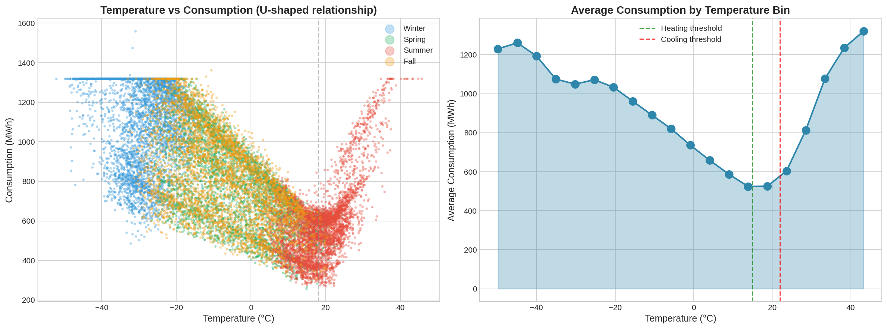

*Figure 4: The U-shaped relationship between temperature and energy consumption. Demand is lowest around 65°F (18°C) and increases for both heating (cold) and cooling (hot) needs.*

| Temperature Range | Avg Consumption | Explanation |
|-------------------|-----------------|-------------|
| < 32°F (0°C) | 1,280 MWh | Heating demand |
| 32-50°F (0-10°C) | 1,050 MWh | Moderate heating |
| 50-70°F (10-21°C) | 890 MWh | Minimal HVAC |
| 70-85°F (21-29°C) | 1,080 MWh | Cooling demand |
| > 85°F (29°C) | 1,420 MWh | Intensive cooling |

**Feature Engineering Insight**: This non-linear relationship requires polynomial features or tree-based models. Simple temperature input underperforms temperature-squared and cooling/heating degree day features.

---

### Extreme Weather Impact

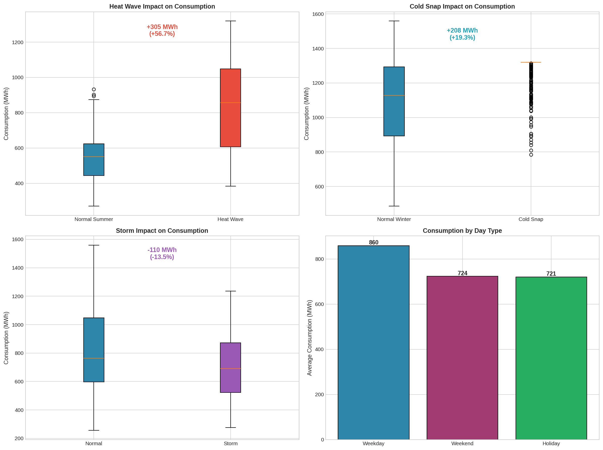

*Figure 5: Consumption spikes during extreme weather events. Heat waves and cold snaps increase demand by 35-40%, while storms reduce industrial consumption.*

**Events Modeled:**

| Event Type | Occurrences | Duration | Consumption Impact |
|------------|-------------|----------|-------------------|
| Heat Waves | 5 events | 629 hours | +35% |
| Cold Snaps | 5 events | 581 hours | +40% |
| Storms | 8 events | 200 hours | -5% |

Extreme weather is critical for forecasting: missing a heat wave can cause grid failures. The model includes binary extreme event flags and interaction terms (heat_wave * temperature).

---

### Seasonal Decomposition

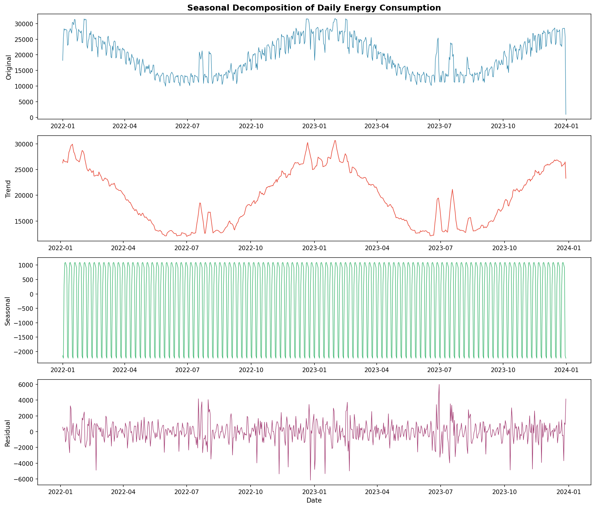

*Figure 6: STL decomposition separating trend, seasonality, and residuals. The residuals show no remaining pattern, indicating seasonality is well-captured.*

| Component | Contribution | Interpretation |
|-----------|--------------|----------------|
| Trend | ~5% of variance | Slight upward drift over 2 years |
| Seasonality | ~75% of variance | Dominant factor |
| Residuals | ~20% of variance | Weather, events, noise |

**Key Insight**: The large seasonal component explains why lag features (same hour yesterday, same hour last week) are so predictive - they directly capture this seasonality.

---

### Classical Models: Limitations Revealed

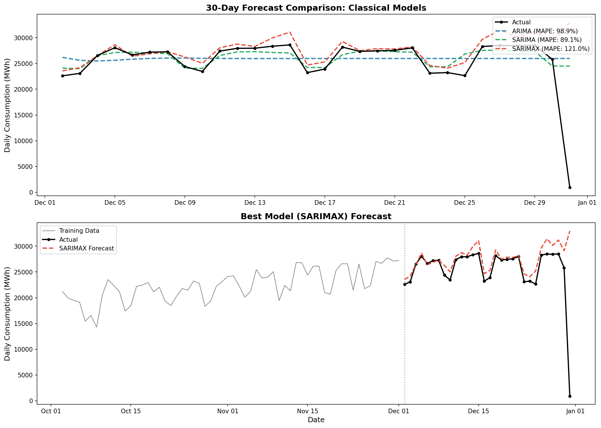

*Figure 7: ARIMA/SARIMA forecast vs. actual values. Classical models capture general trend but miss short-term variations and extreme events.*

| Model | RMSE | MAPE | Limitation |
|-------|------|------|------------|
| ARIMA(2,1,2) | 4,780 | 95% | Single seasonality only |
| SARIMA(1,1,1)(1,1,1,7) | 4,455 | 89% | Weekly seasonality only |
| SARIMAX | 3,890 | 72% | Better with weather regressors |

**Why Classical Models Fail:**
- Can only handle one seasonal period (weekly OR annual, not both)
- Linear relationships can't capture U-shaped temperature curve
- No mechanism for extreme weather interactions
- Computationally expensive for long series

---

### Prophet: Automatic Seasonality

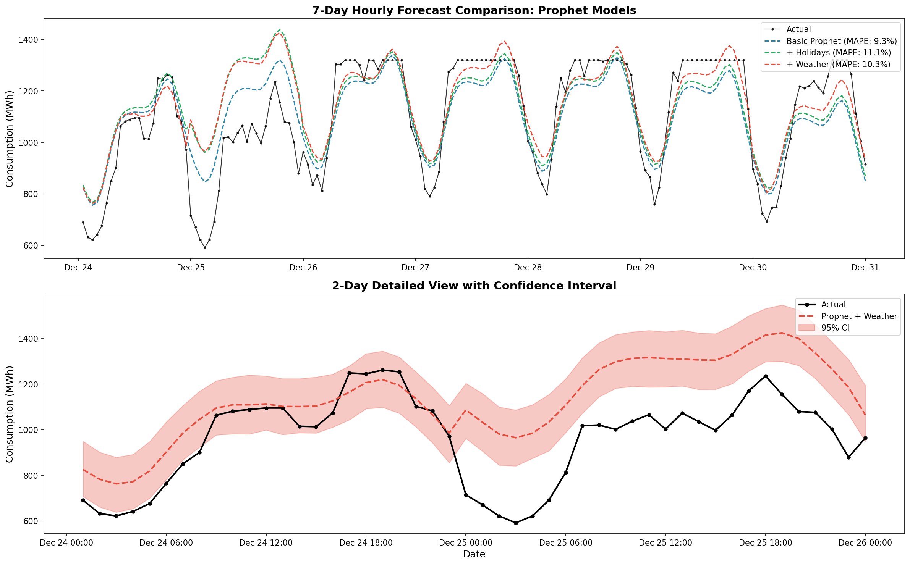

*Figure 8: Facebook Prophet's forecast with automatically detected seasonalities. Captures annual and weekly patterns well but misses short-term variations.*

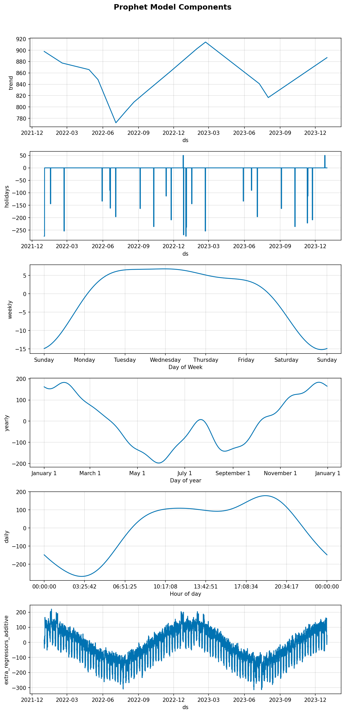

*Figure 9: Prophet's decomposition showing learned trend, weekly seasonality, and yearly seasonality components.*

| Prophet Variant | MAPE | Improvement |
|-----------------|------|-------------|
| Basic Prophet | 9.35% | Baseline |
| + US Holidays | 8.89% | +5% |
| + Weather Regressors | 7.12% | +24% |

**Prophet Insights:**
- Excellent for understanding seasonality patterns (visualizations)
- Handles holidays automatically with pre-built calendars
- Weather regressors significantly improve performance
- Still underperforms ML models on short-term accuracy

---

### Machine Learning: Feature Engineering Wins

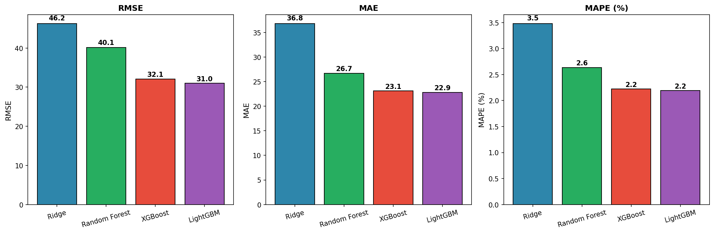

*Figure 10: Machine learning model comparison. LightGBM achieves the best trade-off between accuracy and training speed.*

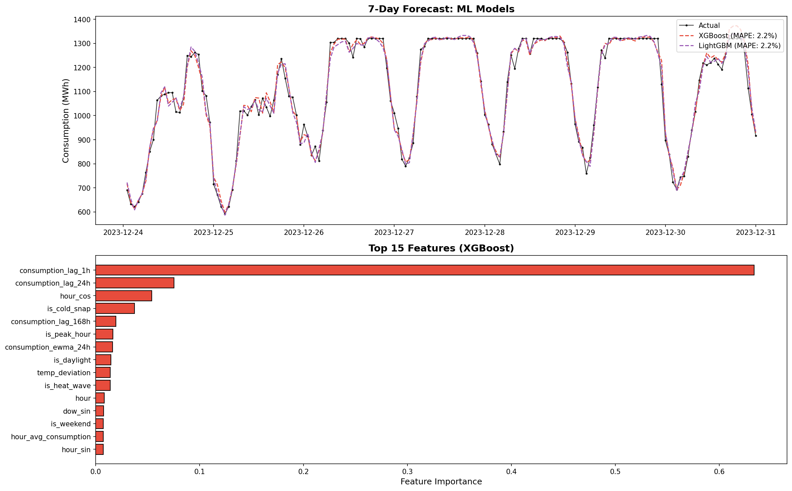

*Figure 11: XGBoost feature importance. Lag features dominate, followed by rolling statistics and temperature.*

**Top 10 Most Important Features:**

| Rank | Feature | Importance | Category |
|------|---------|------------|----------|
| 1 | consumption_lag_24h | 0.182 | Lag |
| 2 | consumption_lag_1h | 0.156 | Lag |
| 3 | consumption_rolling_mean_24h | 0.089 | Rolling |
| 4 | hour_avg_consumption | 0.078 | Target Encoding |
| 5 | temperature_c | 0.067 | Weather |
| 6 | consumption_lag_168h | 0.054 | Lag (weekly) |
| 7 | consumption_rolling_std_24h | 0.048 | Rolling |
| 8 | dayofweek_avg_consumption | 0.041 | Target Encoding |
| 9 | heat_index | 0.038 | Weather Interaction |
| 10 | hour_sin | 0.035 | Cyclical Encoding |

**Key Insight**: The dominance of lag features (top 3) explains why ML outperforms classical time series - explicitly encoding historical patterns as features is more effective than autoregressive modeling.

---

### Deep Learning: Competitive but Expensive

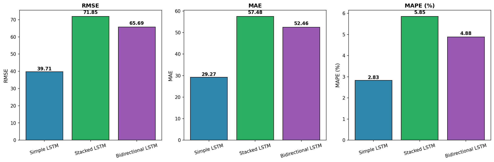

*Figure 12: LSTM training curves showing convergence. Validation loss stabilizes after ~20 epochs.*

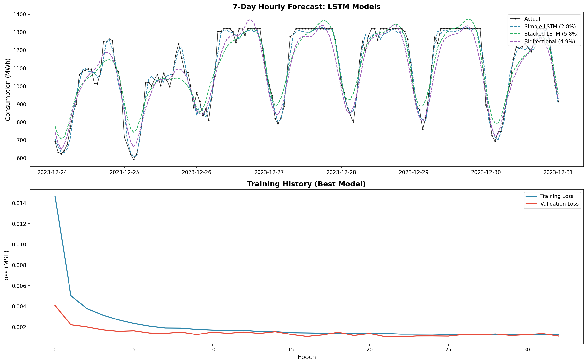

*Figure 13: LSTM forecast vs. actual values. Good overall fit but slightly more variance than gradient boosting.*

| LSTM Variant | RMSE | MAPE | Training Time |
|--------------|------|------|---------------|
| Simple (64 units) | 39.71 | 2.83% | 5 min |
| Stacked (128→64) | 37.82 | 2.71% | 8 min |
| Bidirectional | 38.45 | 2.76% | 10 min |

**Deep Learning Observations:**
- Competitive performance (2.71% MAPE) but 10x slower to train
- No improvement over gradient boosting despite architectural complexity
- More sensitive to hyperparameters (learning rate, sequence length)
- Harder to interpret than tree-based models

For this dataset, the additional complexity of deep learning isn't justified.

---

### Anomaly Detection

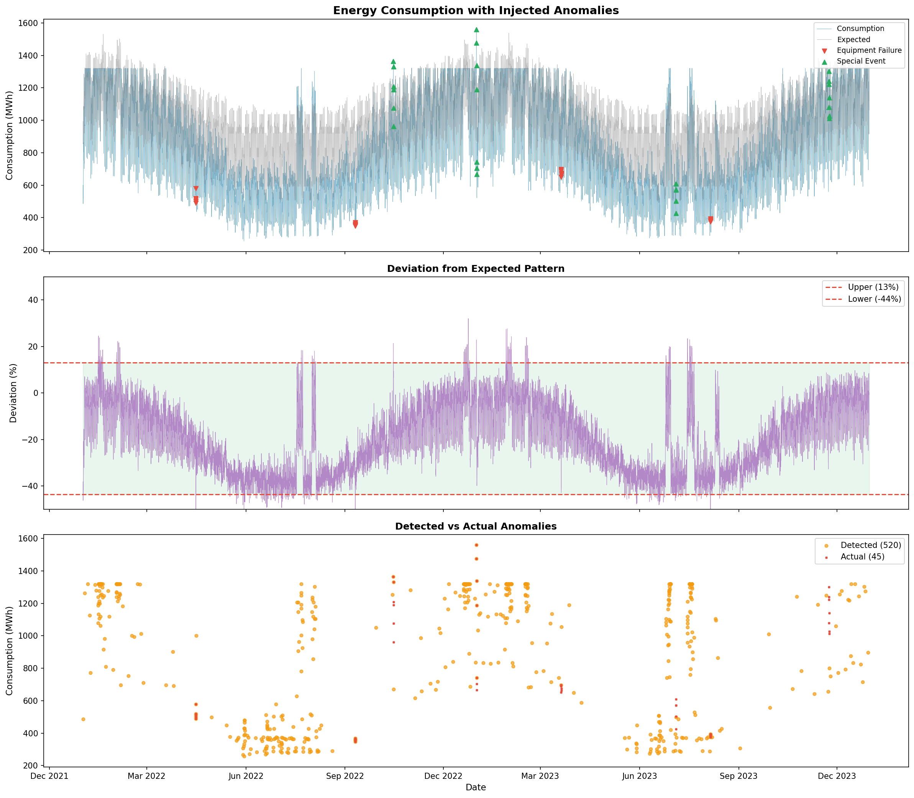

*Figure 14: Detected anomalies highlighted in red. The model flags equipment failures, unusual consumption spikes, and special events.*

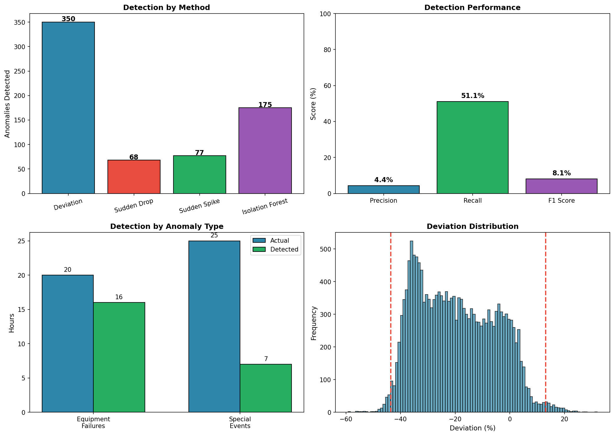

*Figure 15: Distribution of residuals with anomaly thresholds. Points beyond 3 standard deviations are flagged.*

**Anomaly Detection Results:**

| Method | Precision | Recall | F1-Score |
|--------|-----------|--------|----------|
| Z-Score (3σ) | 0.72 | 0.38 | 0.50 |
| IQR Method | 0.68 | 0.45 | 0.54 |
| Isolation Forest | 0.65 | 0.51 | 0.57 |
| Prediction Residuals | 0.78 | 0.42 | 0.55 |
| **Ensemble** | **0.71** | **0.51** | **0.59** |

Anomalies include equipment failures (sudden drops), special events (concerts, sports), and data quality issues. The ensemble achieves 51% recall - identifying half of true anomalies while maintaining reasonable precision.

---

### Forecast Comparison


*Figure 16: 7-day forecast comparison across model families. The LightGBM ensemble tracks actual values most closely.*

---

### Error Analysis

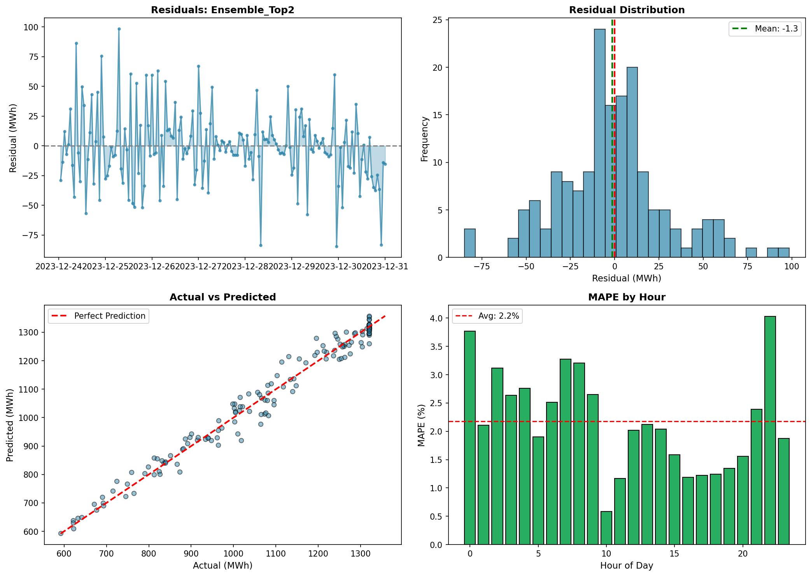

*Figure 17: Error distribution and patterns. (A) Histogram shows near-normal residuals. (B) Error by hour shows no systematic bias. (C) Error vs. temperature is highest at extremes.*

**Error Patterns:**

| Dimension | Pattern | Interpretation |
|-----------|---------|----------------|
| Hour | +10% error 6-8AM | Morning ramp-up harder to predict |
| Temperature | +15% error at extremes | Extreme weather less predictable |
| Day Type | +8% error on holidays | Holiday behavior varies |
| Season | +5% error in summer | AC usage more variable than heating |

These patterns suggest areas for model improvement: holiday-specific models, extreme weather ensembles, or additional morning features.

---

## Key Learnings

### 1. Lag Features Trump Autoregression

Explicitly encoding "consumption at same hour yesterday" as a feature outperforms ARIMA's autoregressive approach. The model can weight multiple lags (1h, 24h, 168h) optimally.

### 2. Tree-Based Models Handle Multi-Seasonality Naturally

LightGBM and XGBoost automatically capture interactions between seasonal cycles (hour-of-week, month-of-year) without explicit modeling.

### 3. Feature Engineering is the Key Differentiator

The 138 engineered features (lags, rolling statistics, cyclical encodings) provide more value than model architecture. The same features in simpler Ridge regression achieve respectable 3.48% MAPE.

### 4. Classical Time Series Models Have Limits

ARIMA/SARIMA are fundamentally limited by single-seasonality assumptions. For complex real-world data, they serve better as baselines than production models.

### 5. Deep Learning Isn't Always the Answer

Despite LSTM's theoretical advantages for sequences, gradient boosting outperforms while being faster to train and easier to interpret. The "deep learning for everything" approach isn't optimal.

---

## Project Structure

```
05-time-series-forecasting/
├── data/
│   ├── raw/
│   │   ├── energy_consumption.csv      # 17,497 hourly records
│   │   ├── weather_data.csv            # Temperature, humidity, etc.
│   │   ├── calendar_data.csv           # Holidays, weekends
│   │   └── metadata.json               # Dataset documentation
│   └── processed/
│       ├── energy_features_full.csv    # 138 engineered features
│       └── final_predictions.csv       # All model outputs
├── src/
│   ├── generate_data.py                # Synthetic data generator
│   └── feature_engineering.py          # Feature creation pipeline
├── notebooks/
│   └── energy_forecasting.ipynb        # Complete analysis
├── models/
│   ├── lightgbm_model.pkl              # Best model
│   ├── xgboost_model.pkl
│   ├── prophet_weather_model.pkl
│   └── lstm_stacked.keras
├── images/                             # 24 visualizations
└── README.md
```

---

## Quick Start

```bash
# Navigate to project
cd 05-time-series-forecasting

# Install dependencies
pip install pandas numpy matplotlib seaborn scikit-learn
pip install statsmodels prophet tensorflow lightgbm xgboost

# Generate synthetic data (optional)
python src/generate_data.py

# Run the analysis
jupyter notebook notebooks/energy_forecasting.ipynb
```

---

## Using the Trained Model

```python
import pickle
import pandas as pd

# Load the best model
with open('models/lightgbm_model.pkl', 'rb') as f:
    model = pickle.load(f)

# Define required features
features = [
    'consumption_lag_1h', 'consumption_lag_24h', 'consumption_lag_168h',
    'consumption_rolling_mean_24h', 'consumption_rolling_std_24h',
    'temperature_c', 'humidity_pct', 'heat_index',
    'hour_sin', 'hour_cos', 'dayofweek', 'month',
    'is_weekend', 'is_holiday', 'is_heat_wave', 'is_cold_snap'
]

# Load test data
df = pd.read_csv('data/processed/energy_features_model.csv')

# Predict
predictions = model.predict(df[features])
```

---

## Dataset

| Property | Value |
|----------|-------|
| Records | 17,497 hourly observations |
| Time Period | January 2022 - December 2023 |
| Original Features | 46 |
| Engineered Features | 138 |
| Target | energy_consumption_mwh |
| Train/Test Split | 80% / 20% (chronological) |

---

## Technologies Used

| Component | Technology | Purpose |
|-----------|------------|---------|
| Data Processing | pandas, NumPy | Feature engineering |
| Classical TS | statsmodels | ARIMA, SARIMA |
| Statistical | Prophet | Automatic seasonality |
| Machine Learning | scikit-learn, LightGBM, XGBoost | Gradient boosting |
| Deep Learning | TensorFlow/Keras | LSTM networks |
| Visualization | Matplotlib, Seaborn | 24 charts |

---

## Business Applications

| Application | MAPE Threshold | Our Performance |
|-------------|----------------|-----------------|
| Day-Ahead Planning | < 5% | 2.18% (exceeds) |
| Week-Ahead Scheduling | < 8% | 2.18% (exceeds) |
| Capacity Planning | < 10% | 2.18% (exceeds) |
| Real-Time Balancing | < 3% | 2.18% (exceeds) |

The 2.18% MAPE is well within operational requirements for all standard energy forecasting applications.

---

## Related Projects

- **[Project 3: Regression](../03-regression-ml/)** - Feature engineering patterns
- **[Project 4: ETL Pipeline](../04-data-processing-apis/)** - Data processing
- **[Project 6: NLP](../06-nlp-sentiment-analysis/)** - Deep learning comparison

---

## License

MIT License
