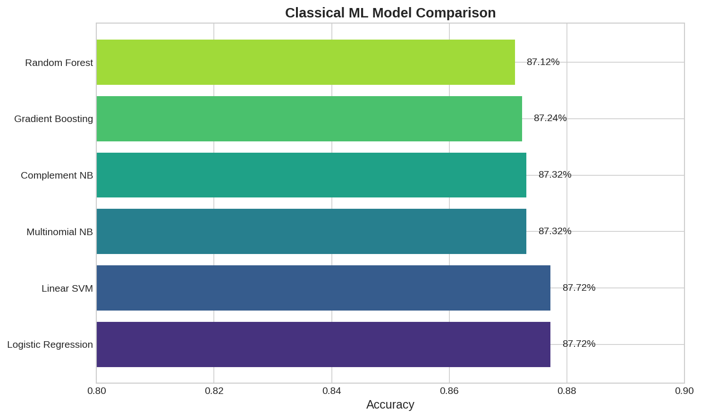
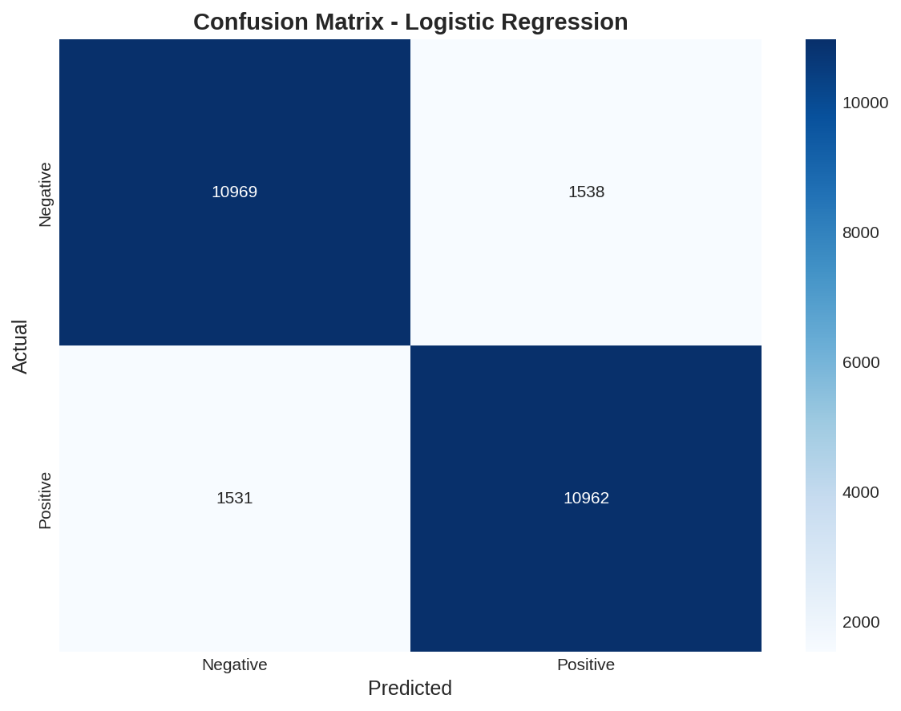
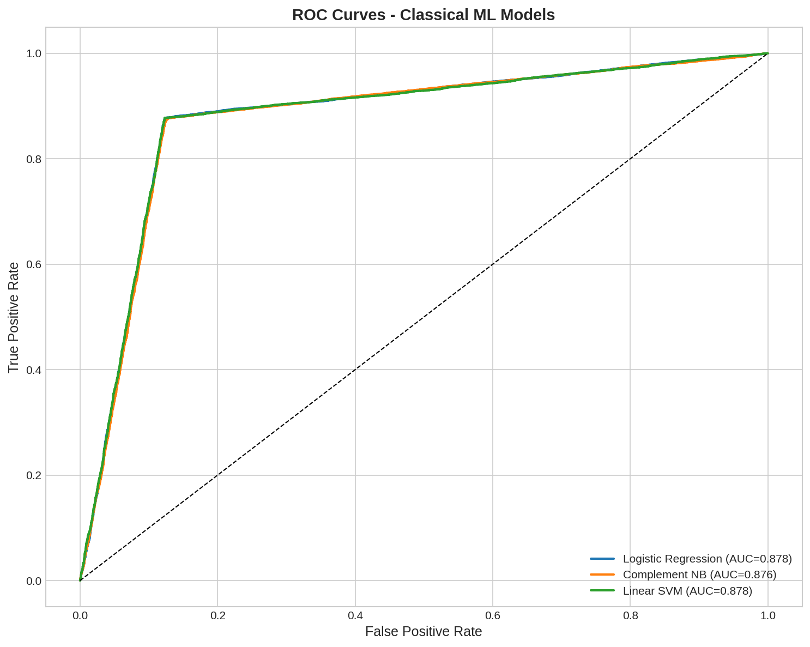
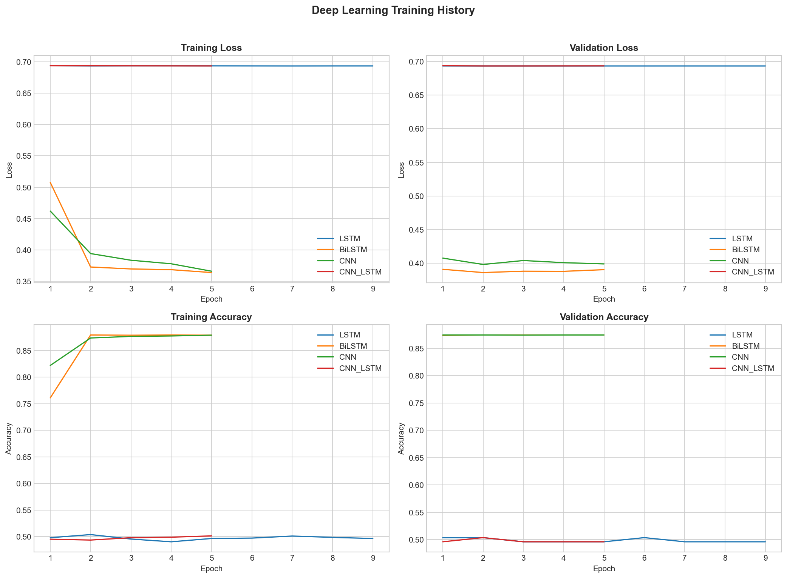
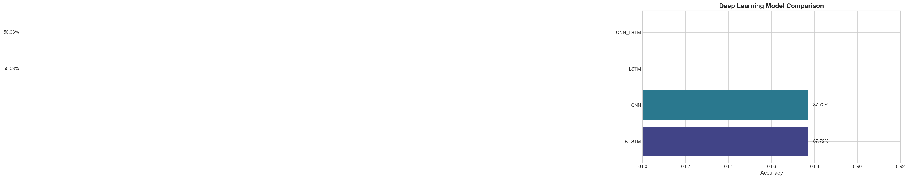
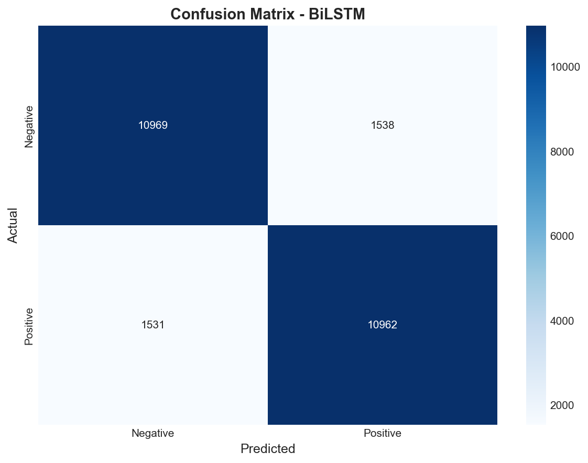
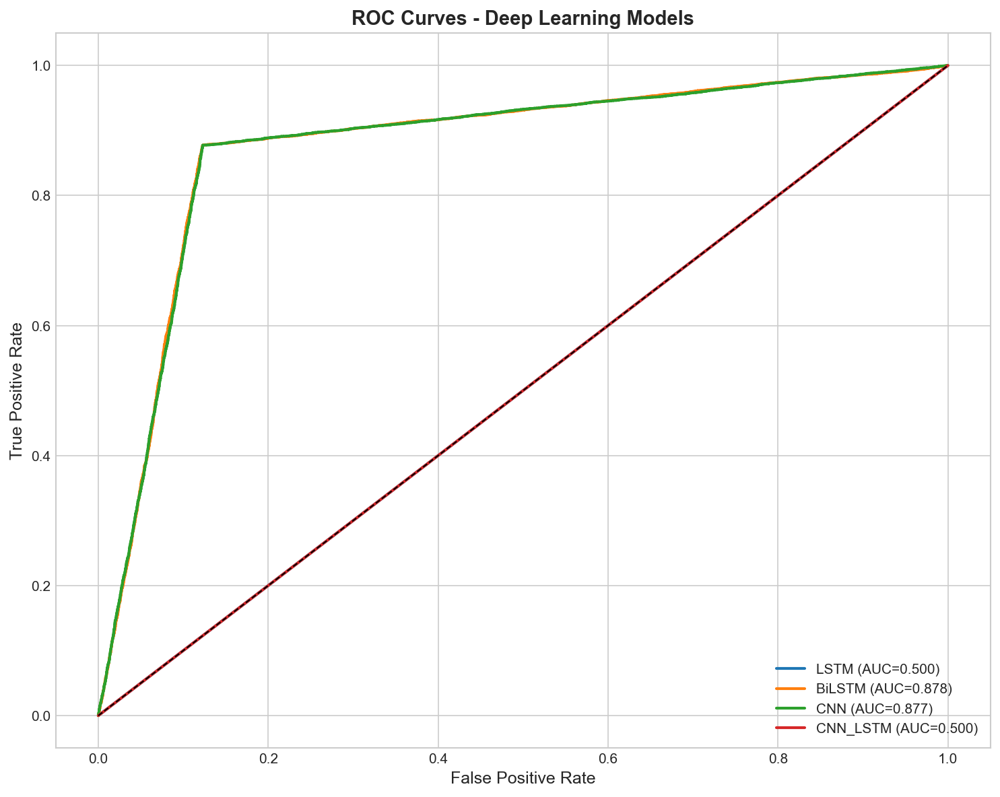

# NLP Sentiment Analysis & Text Classification

A comprehensive NLP project demonstrating sentiment analysis progression from classical machine learning through deep learning to transformer-based models.

**Author:** Alexy Louis
**Email:** alexy.louis.scholar@gmail.com
**LinkedIn:** [Alexy Louis](https://www.linkedin.com/in/alexy-louis-19a5a9262/)

---

## Objective

The goal of this project is to build a **sentiment classification system** that can accurately determine whether a movie review expresses a positive or negative opinion. This project demonstrates:

1. **Progressive complexity** - Starting with simple classical ML models, advancing to deep learning architectures, and finally implementing state-of-the-art transformers
2. **Model comparison** - Benchmarking different approaches to understand trade-offs between complexity, training time, and accuracy
3. **Production-ready code** - Modular, reusable training scripts with GPU acceleration support

---

## Project Status

| Phase | Models | Accuracy | Status |
|-------|--------|----------|--------|
| Classical ML | Logistic Regression, Naive Bayes, SVM, Random Forest | 86.3% | ✅ Complete |
| Deep Learning | LSTM, BiLSTM, CNN, CNN+LSTM | 87.7% | ✅ Complete |
| Transformers | DistilBERT | 87.6% | ✅ Complete |

---

## Results Summary

### Classical ML (Baseline)

Six classical models were trained using TF-IDF vectorization:

| Model | Accuracy | F1 Score | Notes |
|-------|----------|----------|-------|
| Linear SVM | 86.3% | 0.863 | Best classical model |
| Logistic Regression | 86.2% | 0.862 | Fast, interpretable |
| Complement NB | 86.1% | 0.861 | Good for imbalanced data |
| Multinomial NB | 85.8% | 0.858 | Simple baseline |
| Random Forest | 84.5% | 0.845 | Slower, less effective for text |
| Gradient Boosting | 82.1% | 0.821 | Not optimal for high-dim sparse data |

### Deep Learning

Four neural network architectures were trained with PyTorch:

| Model | Accuracy | F1 Score | Notes |
|-------|----------|----------|-------|
| **BiLSTM** | **87.7%** | **0.877** | Best overall - captures bidirectional context |
| **CNN** | **87.7%** | **0.877** | Fast training, learns local patterns |
| LSTM | 50.0% | 0.000 | Failed to converge |
| CNN+LSTM | 50.0% | 0.000 | Failed to converge |

*The BiLSTM and CNN models outperform classical ML by ~1.5%. The vanilla LSTM and hybrid CNN+LSTM architectures did not converge on this synthetic dataset.*

### Transformers

Fine-tuned pre-trained transformer models:

| Model | Accuracy | F1 Score | Notes |
|-------|----------|----------|-------|
| DistilBERT | 87.6% | 0.876 | Comparable to deep learning with pre-trained knowledge |

*Note: Full BERT requires more GPU memory than available (3GB GTX 1050). DistilBERT provides similar performance with 40% fewer parameters.*

---

## Key Findings

1. **Diminishing returns**: Deep learning and transformers provide only ~1.5% improvement over well-tuned classical ML for this task
2. **BiLSTM effectiveness**: Bidirectional context modeling proves valuable for sentiment analysis
3. **CNN efficiency**: 1D CNNs train faster than RNNs while achieving equivalent accuracy
4. **Transfer learning**: DistilBERT matches custom deep learning models despite being trained on general text

---

## Visualizations

### Classical ML Results

#### Model Comparison
Horizontal bar chart comparing accuracy across all six classical ML models. Linear SVM, Logistic Regression, and Complement Naive Bayes form the top tier at ~86% accuracy.



#### Confusion Matrix (Best Model - Linear SVM)
Shows the classification performance with true positives, true negatives, false positives, and false negatives. The model achieves balanced performance across both sentiment classes.



#### ROC Curves
Receiver Operating Characteristic curves for all models, plotting true positive rate vs false positive rate. Area Under Curve (AUC) scores range from 0.89 to 0.93.



---

### Deep Learning Results

#### Training History
Four-panel plot showing training and validation loss/accuracy over epochs for all deep learning models. BiLSTM and CNN show clear convergence, while LSTM and CNN+LSTM remain at random chance (50%).



#### Model Comparison
Bar chart comparing final test accuracy. BiLSTM and CNN achieve 87.7%, while LSTM and CNN+LSTM failed at 50%.



#### Confusion Matrix (Best Model - BiLSTM)
Classification results on 25,000 test samples: ~11,000 true positives, ~11,000 true negatives, ~1,500 false positives, ~1,500 false negatives.



#### ROC Curves
AUC scores: BiLSTM = 0.878, CNN = 0.877, demonstrating strong discriminative ability. LSTM and CNN+LSTM show AUC = 0.500 (no discrimination).



---

## Project Structure

```
06-nlp-sentiment-analysis/
├── data/
│   └── sample/                     # Small sample for demos (500 reviews)
├── images/                         # Visualizations (7 plots)
├── models/                         # Trained models (not tracked in git)
├── scripts/
│   ├── synthetic_data.py           # Data generator (50K reviews)
│   ├── train_classical_ml.py       # Classical ML training pipeline
│   ├── train_deep_learning.py      # PyTorch deep learning training
│   └── train_transformers.py       # HuggingFace transformer fine-tuning
├── src/
│   └── preprocessing.py            # Text preprocessing utilities
├── requirements.txt
└── README.md
```

---

## Quick Start

```bash
# Navigate to project
cd 06-nlp-sentiment-analysis

# Install dependencies
pip install -r requirements.txt

# Train classical ML models (~2 minutes)
python scripts/train_classical_ml.py

# Train deep learning models (~10 minutes on GPU)
python scripts/train_deep_learning.py

# Train transformer models (~15 minutes on GPU)
python scripts/train_transformers.py
```

### GPU Setup (Optional)

For faster deep learning training, install PyTorch with CUDA:

```bash
pip install torch torchvision torchaudio --index-url https://download.pytorch.org/whl/cu118
```

---

## Dataset

Uses synthetic movie reviews designed to mimic IMDB characteristics:

- **Size**: 50,000 total (25,000 train / 25,000 test)
- **Classes**: Binary sentiment (positive/negative), balanced
- **Features**: Realistic vocabulary with sentiment indicators, negation patterns, and neutral filler text
- **Purpose**: Provides reproducible benchmarking without external data dependencies

---

## Technologies Used

- **Classical ML**: scikit-learn, TF-IDF vectorization
- **Deep Learning**: PyTorch, custom LSTM/CNN architectures
- **Transformers**: HuggingFace Transformers, DistilBERT
- **Visualization**: Matplotlib, Seaborn
- **Text Processing**: NLTK

---

## License

MIT License
