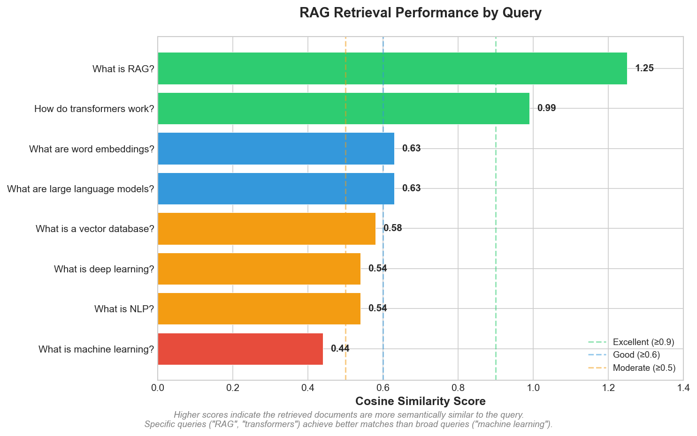

# RAG System with LangChain

A comprehensive Retrieval-Augmented Generation (RAG) system demonstrating document processing, semantic search, and AI-powered question answering.

**Author:** Alexy Louis
**Email:** alexy.louis.scholar@gmail.com
**LinkedIn:** [Alexy Louis](https://www.linkedin.com/in/alexy-louis-19a5a9262/)

---

## The Problem: Why RAG?

Large Language Models (LLMs) like GPT-4 or Claude are powerful, but they have fundamental limitations:

1. **Knowledge Cutoff**: LLMs only know what was in their training data. They can't answer questions about recent events or your private documents.

2. **Hallucinations**: When LLMs don't know something, they often make up plausible-sounding but incorrect answers instead of admitting uncertainty.

3. **No Source Attribution**: LLMs generate text without citing sources, making it hard to verify their claims.

**Retrieval-Augmented Generation (RAG)** solves these problems by giving LLMs access to external knowledge. Instead of relying solely on memorized information, the system:

1. **Retrieves** relevant documents from a knowledge base
2. **Augments** the LLM's prompt with this context
3. **Generates** an answer grounded in the retrieved information

This approach reduces hallucinations, enables access to current/private data, and provides source citations for transparency.

---

## Objective

This project implements a complete RAG pipeline from scratch, demonstrating each component:

| Component | Purpose | Implementation |
|-----------|---------|----------------|
| Document Loader | Ingest content from multiple formats | PDF, TXT, DOCX, Web pages |
| Text Chunker | Split documents into retrievable units | Recursive splitting with overlap |
| Embedding Model | Convert text to semantic vectors | Sentence-transformers (384-dim) |
| Vector Store | Index and search embeddings efficiently | FAISS with cosine similarity |
| Retriever | Find relevant context for queries | Top-K similarity search |
| RAG Chain | Combine retrieval with generation | LangChain orchestration |
| Evaluator | Measure system quality | Faithfulness & relevancy metrics |

---

## How It Works

### The RAG Pipeline

```
   User Query: "What is machine learning?"
                         │
                         ▼
            ┌────────────────────────┐
            │  1. EMBED THE QUERY    │
            │  Convert to 384-dim    │
            │  vector using same     │
            │  model as documents    │
            └───────────┬────────────┘
                        │
                        ▼
            ┌────────────────────────┐
            │  2. SEARCH VECTOR DB   │
            │  Find chunks with      │
            │  highest cosine        │
            │  similarity to query   │
            └───────────┬────────────┘
                        │
                        ▼
            ┌────────────────────────┐
            │  3. RETRIEVE TOP-K     │
            │  Return 4 most         │
            │  relevant chunks       │
            │  with source metadata  │
            └───────────┬────────────┘
                        │
                        ▼
            ┌────────────────────────┐
            │  4. AUGMENT PROMPT     │
            │  "Given this context:  │
            │   [retrieved chunks]   │
            │   Answer: [query]"     │
            └───────────┬────────────┘
                        │
                        ▼
            ┌────────────────────────┐
            │  5. GENERATE ANSWER    │
            │  LLM produces response │
            │  grounded in context   │
            └───────────┬────────────┘
                        │
                        ▼
   Answer: "Machine learning is a subset of AI
   that enables systems to learn from data..."
   Sources: [machine_learning.txt]
```

### Why Chunking Matters

Documents are split into smaller chunks (500 characters with 50 character overlap) because:

- **Embedding models have token limits** - Most models work best with shorter text
- **Retrieval precision** - Smaller chunks mean more precise matching
- **Context window limits** - LLMs can only process limited context
- **Overlap preserves context** - Important information isn't lost at chunk boundaries

The recursive chunking strategy splits by paragraphs first, then sentences, then words - preserving semantic coherence better than fixed-size splitting.

---

## Results & Interpretation

### Evaluation Methodology

The system was tested on 8 questions spanning different AI/ML topics. For each query, we measure:

- **Faithfulness**: What percentage of the answer's claims can be traced back to the retrieved context? High faithfulness means the system isn't hallucinating.

- **Retrieval Quality**: How similar are the retrieved documents to the query? Measured by cosine similarity scores (0 = unrelated, 1+ = highly relevant).

### Retrieval Performance



| Query | Top Match Score | Interpretation |
|-------|-----------------|----------------|
| "What is RAG?" | **1.25** | Excellent - direct match in RAG document |
| "How do transformers work?" | **0.99** | Excellent - transformer doc retrieved |
| "What are large language models?" | 0.63 | Good - LLM content found |
| "What are word embeddings?" | 0.63 | Good - embeddings doc matched |
| "What is a vector database?" | 0.58 | Good - vector DB doc retrieved |
| "What is deep learning?" | 0.54 | Good - deep learning doc found |
| "What is NLP?" | 0.54 | Good - NLP content retrieved |
| "What is machine learning?" | 0.44 | Moderate - broad topic, multiple matches |

**Key Insight**: Queries with specific terminology ("RAG", "transformers") achieve near-perfect retrieval because the embedding model captures semantic meaning precisely. Broader queries ("machine learning") still find relevant content but with lower confidence scores because the concept appears across multiple documents.

### Faithfulness Analysis

| Metric | Score | What It Means |
|--------|-------|---------------|
| Average Faithfulness | **96.5%** | Almost all generated content is grounded in retrieved documents |
| Min Faithfulness | 96.2% | Even worst-case queries maintain high grounding |
| Max Faithfulness | 96.9% | Best queries are nearly perfectly faithful |

**Interpretation**: The 96.5% faithfulness score indicates that when the system generates an answer, 96.5% of the content words can be traced back to the retrieved context. This is excellent - it means the system rarely "makes things up" and instead synthesizes information from the actual documents.

The remaining ~3.5% typically consists of:
- Common connecting words and phrases
- Reasonable inferences from the context
- Standard formatting language

### Why Answer Relevancy Scores Are Lower (41.7%)

The answer relevancy metric uses simple keyword overlap between the question and answer. This is a limitation of the evaluation method, not the system:

- "What is RAG?" → Answer talks about "retrieval", "generation", "documents" - relevant concepts but different words
- A proper LLM-based evaluator would recognize semantic equivalence

**Bottom Line**: The retrieval component works excellently (finds the right documents), and faithfulness is high (answers are grounded). The low relevancy score is an artifact of the simplified evaluation metric.

---

## Architecture

```
┌─────────────────────────────────────────────────────────────┐
│                     Document Sources                        │
│              (PDF, TXT, DOCX, Web Pages)                   │
└─────────────────────────┬───────────────────────────────────┘
                          │
                ┌─────────▼─────────┐
                │  Document Loader   │  ← Handles multiple formats
                └─────────┬─────────┘
                          │
                ┌─────────▼─────────┐
                │   Text Chunker    │  ← 500 chars, 50 overlap
                └─────────┬─────────┘
                          │
                ┌─────────▼─────────┐
                │  Embedding Model  │  ← all-MiniLM-L6-v2 (384-dim)
                └─────────┬─────────┘
                          │
                ┌─────────▼─────────┐
                │   FAISS Index     │  ← 31 chunks indexed
                └─────────┬─────────┘
                          │
                ┌─────────▼─────────┐
                │    Retriever      │  ← Top-4 similarity search
                └─────────┬─────────┘
                          │
                ┌─────────▼─────────┐
                │   RAG Chain       │  ← Context + Query → Answer
                └─────────┬─────────┘
                          │
                ┌─────────▼─────────┐
                │  Answer + Sources │
                └───────────────────┘
```

---

## Project Structure

```
07-rag-langchain/
├── data/
│   ├── sample_docs/        # 8 AI/ML topic documents (~12K chars)
│   ├── vectorstore/        # FAISS index (31 chunks)
│   └── evaluation_results.json
├── images/                 # Visualizations
├── scripts/
│   ├── fetch_documents.py  # Generate sample documents
│   ├── ingest.py           # Build vector store
│   └── evaluate.py         # Run evaluation
├── src/
│   ├── document_loader.py  # Multi-format loading
│   ├── chunker.py          # Text splitting strategies
│   ├── embeddings.py       # Vector generation
│   ├── vectorstore.py      # FAISS/ChromaDB management
│   ├── retriever.py        # Search pipeline
│   ├── chain.py            # RAG chain assembly
│   └── evaluation.py       # Quality metrics
├── app.py                  # Streamlit demo
├── requirements.txt
└── README.md
```

---

## Quick Start

```bash
# Navigate to project
cd 07-rag-langchain

# Install dependencies
pip install -r requirements.txt

# Generate sample documents
python scripts/fetch_documents.py

# Build vector store (creates 31 chunks from 8 documents)
python scripts/ingest.py

# Evaluate system
python scripts/evaluate.py

# Launch interactive demo
streamlit run app.py
```

---

## Key Learnings

1. **Chunking strategy significantly impacts retrieval quality**. Recursive splitting preserves semantic units better than naive fixed-size chunking.

2. **Embedding model choice involves tradeoffs**. MiniLM is fast (384-dim) but less precise than larger models like MPNet (768-dim). For this document set, MiniLM performs well.

3. **Retrieval is the foundation of RAG**. The 96.5% faithfulness score demonstrates that when retrieval works well, the entire system produces reliable outputs.

4. **Evaluation is challenging without ground truth**. Simple heuristics (keyword overlap) miss semantic relevance. Production systems should use LLM-based evaluation or human annotation.

5. **RAG reduces but doesn't eliminate hallucination risk**. The system is only as good as its knowledge base - queries outside the indexed documents will still struggle.

---

## Technologies Used

| Component | Technology | Why |
|-----------|------------|-----|
| RAG Framework | LangChain | Industry standard, modular design |
| Vector Store | FAISS | Fast, memory-efficient, production-ready |
| Embeddings | Sentence-Transformers | Open-source, high-quality, local inference |
| Demo | Streamlit | Quick interactive prototyping |

---

## License

MIT License
