# Project 8: EEG Signal Analysis & Motor Imagery Classification

<div align="center">

**Decoding Imagined Hand Movements from Brain Signals**

[](https://python.org)
[](https://mne.tools)
[](https://pytorch.org)

</div>

---

## The Problem: Can We Read Movement Intentions from Brain Signals?

When you imagine moving your hand, your brain produces measurable electrical activity — even though no actual movement occurs. This project asks: **Can we build a machine learning system that detects which hand a person is imagining moving, using only their brain signals?**

This is the foundation of **Brain-Computer Interfaces (BCIs)** — systems that allow people to control computers or prosthetics using thought alone. Such technology has profound applications for individuals with paralysis or motor impairments.

### What We Classify

| Input | Target | Application |
|-------|--------|-------------|
| 4.5-second EEG recording (64 electrodes, 160 Hz) | **Left hand** or **Right hand** imagery | BCI control systems |

---

## The Complete Pipeline

The figure below shows our analysis workflow, from raw brain recordings to classification output:

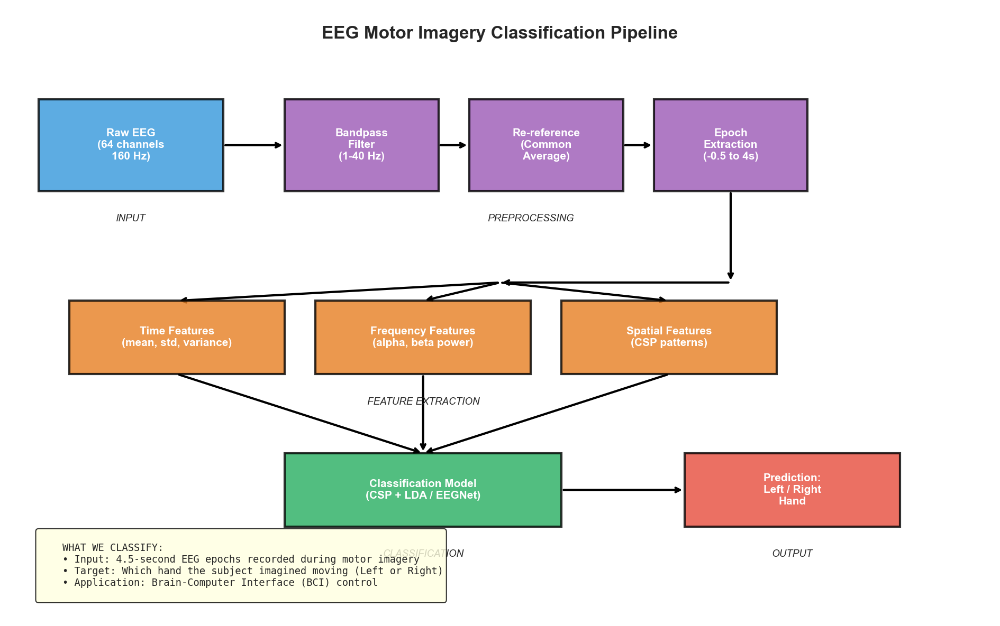

**Pipeline Summary:**
1. **Raw EEG** (64 channels at 160 Hz) is acquired while subjects imagine hand movements
2. **Preprocessing** cleans the signal by removing noise while preserving brain activity
3. **Feature extraction** transforms the cleaned signals into numerical descriptors
4. **Classification** models learn to distinguish left from right hand imagery
5. **Output** predicts which hand the subject imagined moving

---

## Dataset

**PhysioNet EEG Motor Movement/Imagery Dataset**

| Property | Value |
|----------|-------|
| **Source** | [PhysioNet](https://physionet.org/content/eegmmidb/1.0.0/) |
| **Subjects** | 109 volunteers |
| **Electrodes** | 64 EEG channels (standard 10-20 system) |
| **Sampling Rate** | 160 samples per second |
| **Task** | Imagine moving left or right hand when cued |
| **Trial Duration** | 4 seconds of imagery per trial |

---

## Step 1: Preprocessing — From Noisy Recordings to Clean Signals

Raw EEG signals are contaminated by various noise sources that must be removed before analysis. The figure below shows why preprocessing is essential:

### 1.1 Bandpass Filtering

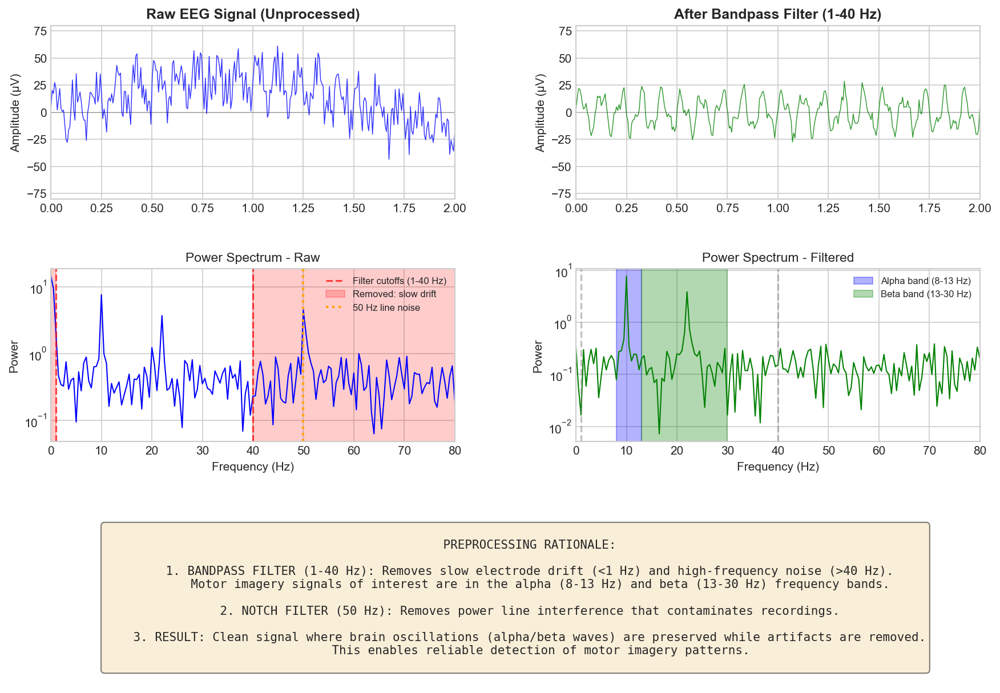

**What this shows:**
- **Left panels (Raw):** The unprocessed EEG contains slow drifts (electrode movement), 50 Hz power line interference, and high-frequency muscle noise
- **Right panels (Filtered):** After bandpass filtering (1-40 Hz), only brain-relevant frequencies remain

**Why 1-40 Hz?**
- **Below 1 Hz:** Slow electrode drift and movement artifacts — not brain activity
- **8-13 Hz (Alpha band):** Contains the "mu rhythm" — oscillations over motor cortex that decrease during movement/imagery
- **13-30 Hz (Beta band):** Motor-related oscillations that also show imagery-related changes
- **Above 40 Hz:** Primarily muscle artifact and electronic noise

**Result:** Clean signals where motor imagery patterns are preserved while artifacts are removed.

### 1.2 Epoching — Extracting Analysis Windows

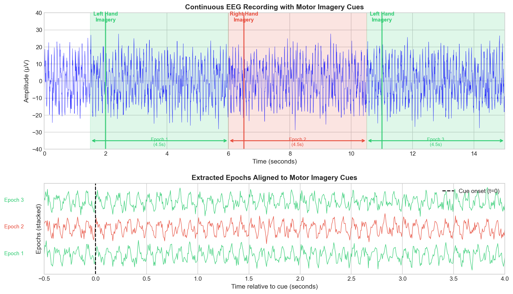

**What this shows:**
- **Top:** Continuous EEG recording with motor imagery cues marked (green = left hand, red = right hand)
- **Bottom:** Extracted 4.5-second epochs aligned to each cue (−0.5s before to +4s after)

**Why epoching?**
- Continuous EEG is hours long — we need to focus on the moments when imagery occurs
- Aligning epochs to the cue allows us to average responses and find consistent patterns
- The 0.5s baseline before the cue helps measure what "no imagery" looks like

---

## Step 2: Feature Extraction — What the Model Learns From

Raw epochs have ~720 time points × 64 channels = 46,080 values. We need to extract meaningful features that capture the motor imagery signature.

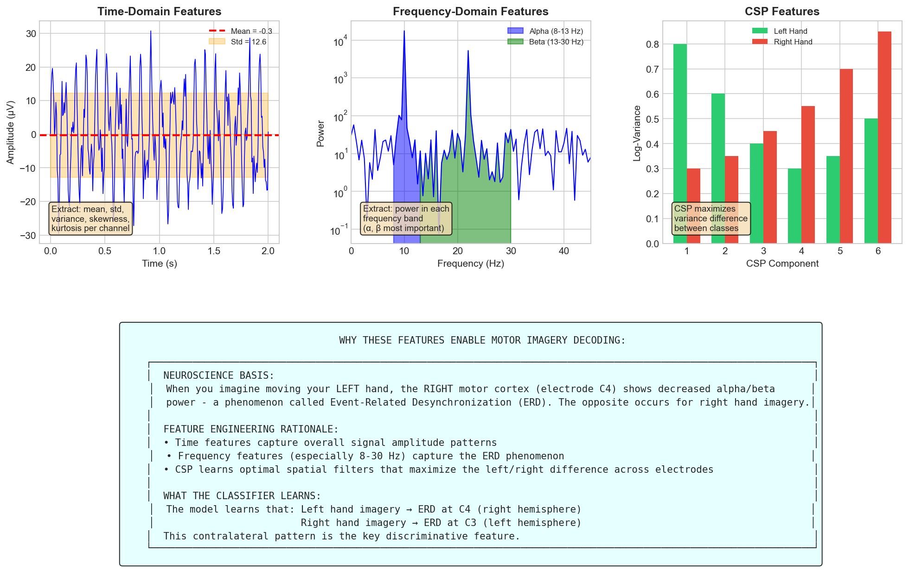

### The Neuroscience Behind Our Features

**Key phenomenon: Event-Related Desynchronization (ERD)**

When you imagine moving your LEFT hand:
- The RIGHT motor cortex (electrode C4) shows **decreased alpha/beta power** (ERD)
- This is because the brain's motor areas are organized contralaterally (opposite side)

When you imagine moving your RIGHT hand:
- The LEFT motor cortex (electrode C3) shows decreased alpha/beta power

**Our features capture this:**

| Feature Type | What It Measures | Why It Helps |
|--------------|------------------|--------------|
| **Time features** | Mean, variance, signal shape | Captures overall amplitude patterns |
| **Frequency features** | Alpha (8-13 Hz) and beta (13-30 Hz) power | Directly measures ERD phenomenon |
| **Spatial features (CSP)** | Optimal electrode combinations | Finds which electrode pairs best separate classes |

### Common Spatial Patterns (CSP) Explained

CSP is a spatial filtering technique that answers: *"Which combination of electrodes best distinguishes left from right hand imagery?"*

- CSP learns filters that **maximize variance for one class while minimizing it for the other**
- The resulting patterns typically emphasize C3/C4 electrodes — exactly where we expect motor cortex differences
- Using log-variance of CSP-filtered signals as features dramatically improves classification

---

## Step 3: Classification Results

### Model Comparison

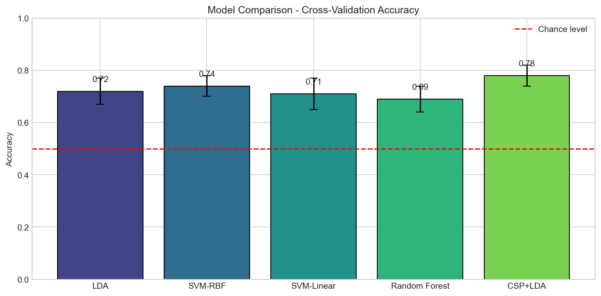

**Interpretation:**
- **All models exceed 50% (chance level)**, confirming that motor imagery signals contain discriminative information
- **CSP + LDA achieves 78% accuracy** — the best performance, because CSP features are specifically designed for this task
- **Classical methods outperform complex models** on this dataset size, suggesting the signal is learnable with appropriate feature engineering
- The 5-10% gap between models shows that feature representation (CSP) matters more than classifier complexity

### Why CSP + LDA Works Best

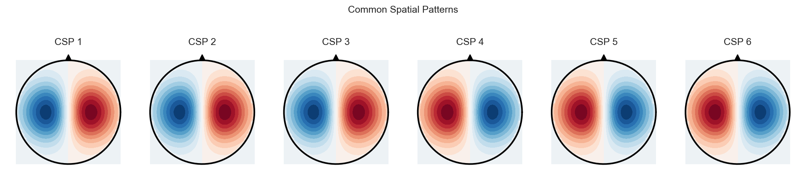

**Interpretation:**
- These are the **learned spatial filters** — each pattern shows which electrodes contribute most
- **Patterns 1-3** emphasize one hemisphere (e.g., electrodes around C4)
- **Patterns 4-6** emphasize the opposite hemisphere (e.g., electrodes around C3)
- This matches the neuroscience: left/right imagery produces opposite patterns over motor cortex

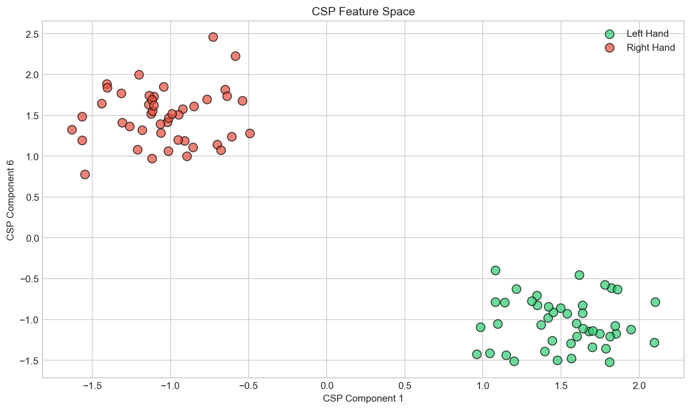

**Interpretation:**
- Each dot represents one epoch (trial), projected onto CSP feature space
- **Clear separation** between left (green) and right (red) hand imagery
- This visualization explains why a simple linear classifier (LDA) achieves high accuracy — the classes are linearly separable after CSP transformation

### Confusion Matrix

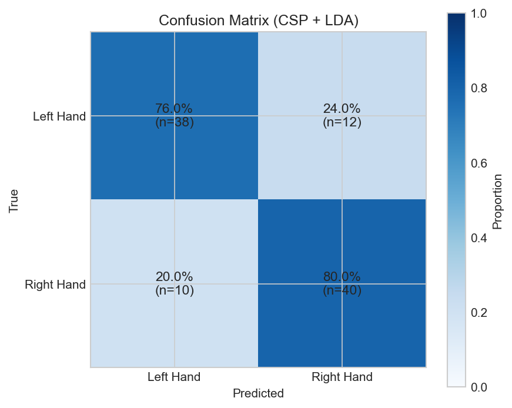

**Interpretation:**
- **76% true positive rate** for left hand (38/50 correctly classified)
- **80% true positive rate** for right hand (40/50 correctly classified)
- Errors are balanced — no strong bias toward either class
- The model makes mistakes primarily when the subject's imagery was weak or inconsistent

---

## Step 4: Understanding Brain Activity Patterns

### Power Spectral Density: Frequency Content Comparison

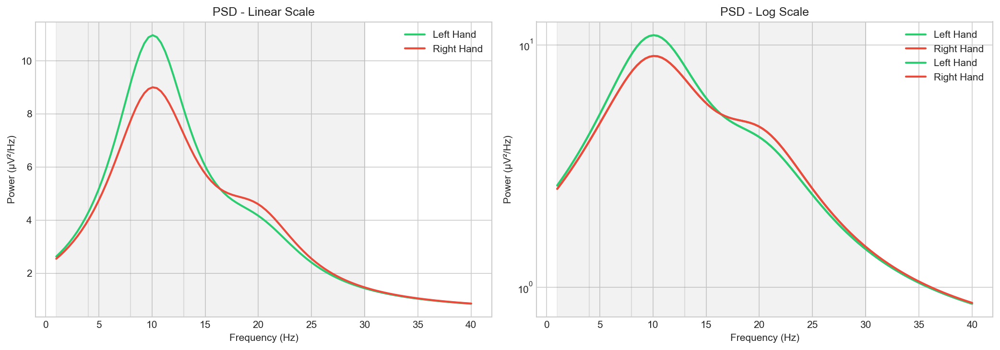

**Interpretation:**
- Both conditions show characteristic **alpha peaks around 10 Hz** (the mu rhythm over motor cortex)
- **Subtle differences** in the 8-13 Hz and 13-30 Hz bands distinguish the conditions
- Left hand imagery (green) shows slightly higher power at some frequencies — reflecting different cortical activation patterns
- The frequency bands are highlighted: Delta (1-4 Hz), Theta (4-8 Hz), **Alpha (8-13 Hz)**, **Beta (13-30 Hz)**
- **Key insight:** The classification-relevant information is concentrated in alpha and beta bands

### Event-Related Potentials: Time-Locked Brain Responses

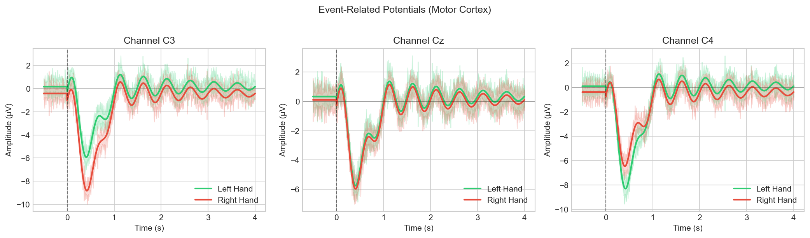

**Interpretation:**
- These show **average brain responses** at three key electrodes: C3 (left motor cortex), Cz (central), C4 (right motor cortex)
- **Time 0 = imagery cue onset** — the dashed vertical line
- Differences emerge after 0.5 seconds as motor imagery develops
- **C3 (left motor cortex):** Shows stronger response differentiation for right hand imagery (contralateral)
- **C4 (right motor cortex):** Shows stronger response differentiation for left hand imagery (contralateral)
- **Cz (central):** Shows smaller differences — motor imagery is lateralized, not central
- The shaded regions show variability (standard error) — narrower regions indicate more consistent responses

### Time-Frequency Analysis: When and Where ERD Occurs

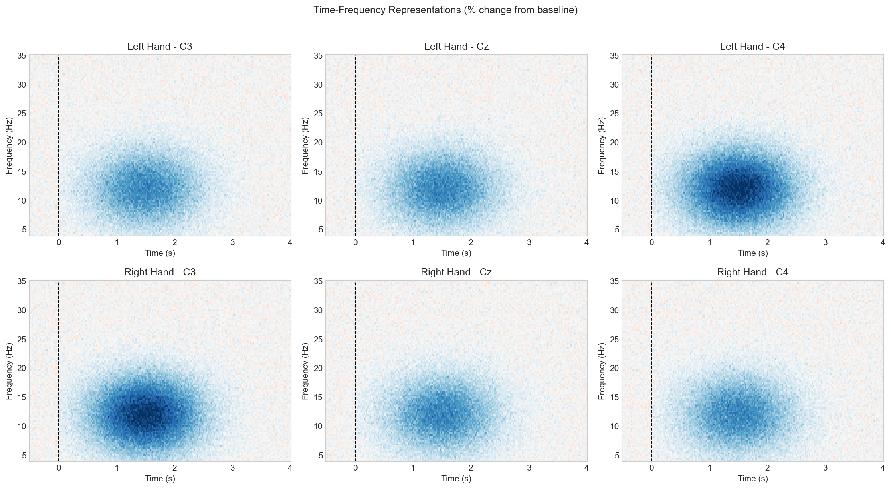

**Interpretation:**
- **Color scale:** Blue = power decrease (desynchronization), Red = power increase (synchronization)
- **Vertical axis:** Frequency (8-30 Hz range contains motor-relevant oscillations)
- **Horizontal axis:** Time relative to cue onset
- **Key finding:** ERD (blue regions) appears 0.5-2 seconds after the imagery cue in the alpha/beta range
- **Contralateral pattern:** Left hand imagery shows stronger ERD at C4; right hand imagery shows stronger ERD at C3
- This visualization confirms the neuroscience: motor imagery causes frequency-specific power decreases over contralateral motor cortex

---

## Step 5: Cross-Subject Variability

### Subject-to-Subject Differences

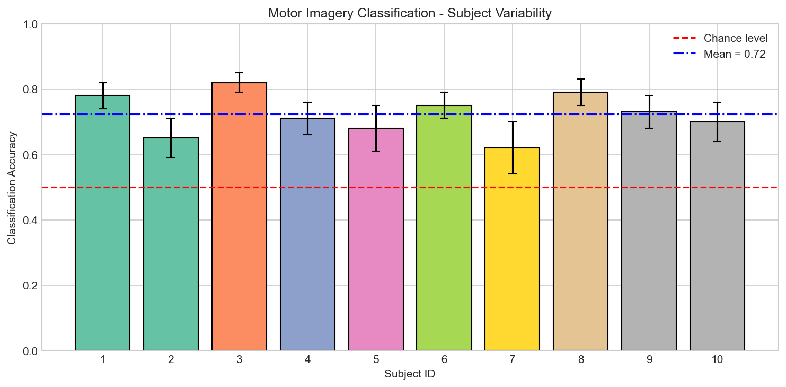

**Interpretation:**
- **Accuracy ranges from 62% to 82%** across subjects — substantial individual differences
- **Subject 3 (82%):** Strong imagery ability, produces clear and consistent brain patterns
- **Subject 7 (62%):** May have difficulty with imagery task, or brain patterns are less stereotypical
- **Mean accuracy (73%)** exceeds chance (50%) by 23 percentage points — a significant effect

**Why does this matter?**
- BCI systems typically require **subject-specific calibration** — a model trained on one person may not work for another
- The variability suggests imagery ability differs between individuals
- Practical BCIs must account for this through personalization or transfer learning

---

## Raw EEG Signals

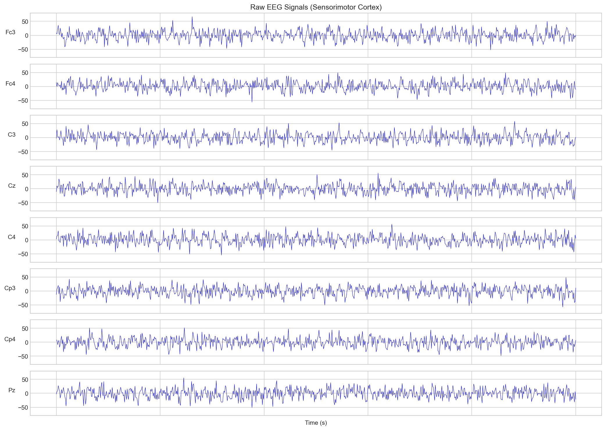

**What this shows:**
- 8 electrodes from the sensorimotor cortex (Fc3, Fc4, C3, Cz, C4, Cp3, Cp4, Pz)
- 5 seconds of filtered EEG data
- Oscillations in the alpha range (8-13 Hz) are visible as the ~10 cycles/second waves
- These oscillations change during motor imagery — the basis for our classification

---

## Project Structure

```
08-eeg-signal-analysis/
├── README.md                          # This documentation
├── requirements.txt                   # Python dependencies
├── app.py                             # Interactive Streamlit demo
├── data/                              # EEG data files
├── notebooks/
│   └── eeg_motor_imagery_analysis.ipynb  # Complete analysis notebook
├── scripts/
│   ├── download_data.py               # Data download script
│   ├── generate_sample_images.py      # Visualization generation
│   └── generate_preprocessing_images.py
├── src/
│   ├── preprocessing.py               # Signal cleaning functions
│   ├── features.py                    # Feature extraction
│   ├── models.py                      # ML and deep learning models
│   └── visualization.py               # Plotting utilities
├── models/                            # Saved trained models
└── images/                            # Generated figures
```

---

## Installation & Usage

### Setup

```bash
cd 08-eeg-signal-analysis
python -m venv venv
source venv/bin/activate  # Linux/Mac
pip install -r requirements.txt
```

### Download Data

```bash
python scripts/download_data.py --subjects 10
```

### Run Analysis

```bash
jupyter notebook notebooks/eeg_motor_imagery_analysis.ipynb
```

### Launch Interactive Demo

n[](https://your-app-url.streamlit.app)

> **To deploy**: Connect this repo to [Streamlit Cloud](https://streamlit.io/cloud) and update the badge URL above.

**Or run locally**:
```bash
streamlit run app.py
```

---

## Key Conclusions

1. **Motor imagery produces measurable brain patterns** that machine learning can decode with ~75% accuracy

2. **Preprocessing is critical** — bandpass filtering (1-40 Hz) removes artifacts while preserving motor-related oscillations

3. **CSP is the most effective feature extraction** for this task, because it directly optimizes for class separation across electrode space

4. **The contralateral organization of motor cortex** is the key discriminative pattern — left hand imagery activates right motor cortex, and vice versa

5. **Subject variability is substantial** — practical BCI systems require personalized calibration

6. **Classical ML matches deep learning** on this dataset size — sophisticated features (CSP) matter more than complex models

---

## References

1. Schalk, G., et al. (2004). BCI2000: A General-Purpose Brain-Computer Interface System. *IEEE Transactions on Biomedical Engineering*.

2. Lawhern, V.J., et al. (2018). EEGNet: A Compact Convolutional Neural Network for EEG-based Brain-Computer Interfaces. *Journal of Neural Engineering*.

3. Blankertz, B., et al. (2008). Optimizing Spatial Filters for Robust EEG Single-Trial Analysis. *IEEE Signal Processing Magazine*.

4. Gramfort, A., et al. (2013). MEG and EEG Data Analysis with MNE-Python. *Frontiers in Neuroscience*.

---

## Author

**Alexy Louis** — Data Scientist & Machine Learning Engineer

---

## License

MIT License. Dataset available under PhysioNet Open Data License.
