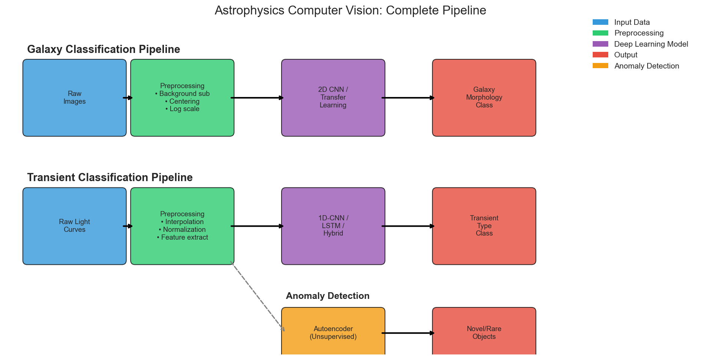
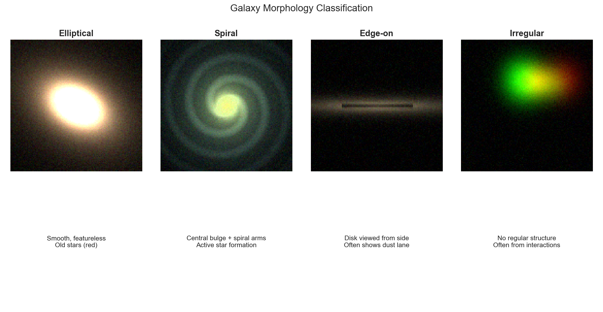
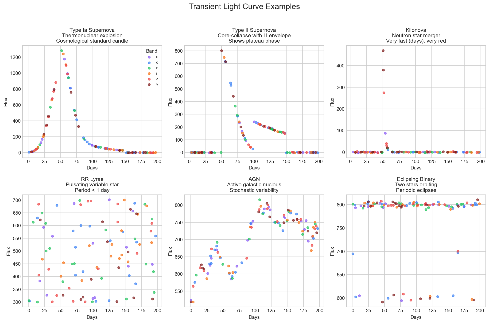
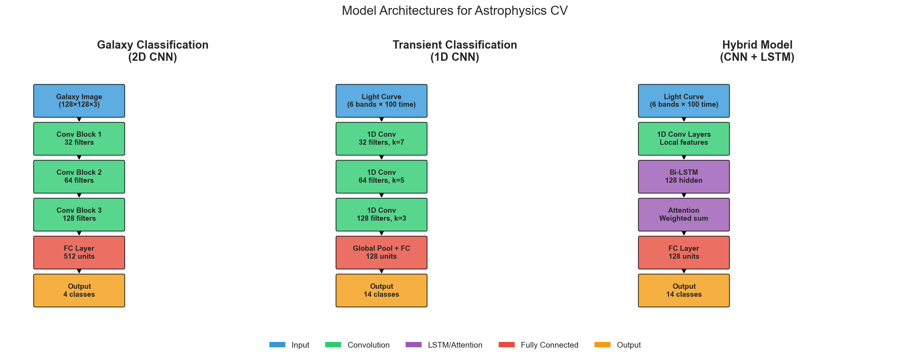
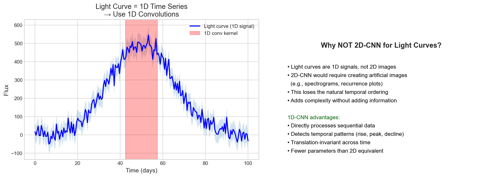
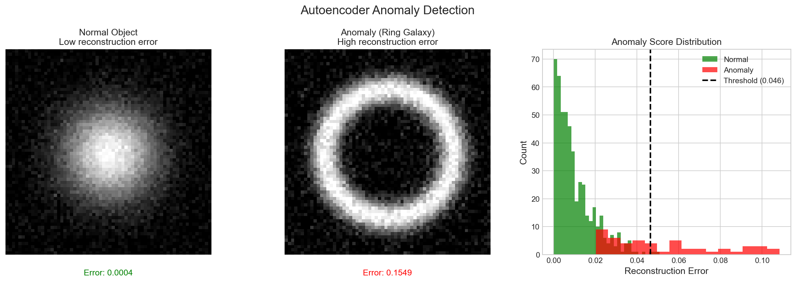

# Astrophysics Computer Vision: Galaxy Morphology & Transient Classification

## Can We Teach Machines to See the Universe Like Astronomers?

Modern astronomical surveys generate data at unprecedented rates. The Vera C. Rubin Observatory (LSST), beginning operations in 2025, will produce **10 million alerts per night**—far beyond human capacity to analyze. This project develops deep learning methods to automatically classify astronomical objects from imaging and time-series data.

We address two fundamental questions:
1. **Galaxy Morphology**: What type of galaxy is this? (Elliptical, Spiral, Edge-on, Irregular)
2. **Transient Classification**: What caused this brightness change? (Supernova, Kilonova, Variable Star, AGN)



**What this diagram shows**: The complete processing pipeline from raw observations to scientific classifications. Galaxy images flow through 2D CNNs, while light curves use 1D-CNN/LSTM architectures—each model chosen specifically for its data type.

---

## The Science: Why These Classifications Matter

### Galaxy Morphology

Galaxy morphology—the shape and structure of galaxies—is a window into cosmic history. The physical appearance encodes:

| Morphology | Physical Characteristics | Scientific Importance |
|------------|-------------------------|----------------------|
| **Elliptical** | Smooth, featureless, red | Formed through major mergers, old stellar populations |
| **Spiral** | Disk with spiral arms, blue regions | Ongoing star formation, disk dynamics |
| **Edge-on** | Disk viewed from the side | Reveals dust lanes, vertical structure |
| **Irregular** | No clear structure | Recent interactions, starbursts |



**Interpretation**: Each morphology type reflects a different evolutionary path. Elliptical galaxies are typically "red and dead"—their star formation ceased long ago after major mergers mixed their stellar orbits. Spiral galaxies maintain ordered rotation with active star formation in their arms. Edge-on views reveal the thin disk structure and dust obscuration. Irregular galaxies often result from gravitational interactions that disrupt normal structure.

### Transient Astronomy

"Transients" are objects that change brightness over time. Classifying them rapidly is crucial for follow-up observations.

| Transient Type | Physical Origin | Timescale | Why It Matters |
|----------------|-----------------|-----------|----------------|
| **Type Ia Supernova** | White dwarf thermonuclear explosion | ~30 days rise | Cosmological distance ladder (Nobel Prize 2011) |
| **Type II Supernova** | Massive star core collapse | ~100 day plateau | Neutron star/black hole formation |
| **Kilonova** | Neutron star merger | 1-2 days | Heavy element production (gold, platinum!) |
| **RR Lyrae** | Stellar pulsation | <1 day period | Distance indicators for old populations |
| **AGN** | Black hole accretion | Stochastic | Supermassive black hole physics |



**Interpretation**: Each transient class has a characteristic "light curve shape" that reflects its underlying physics:

- **Type Ia SNe** show a rapid rise (~15 days) to peak followed by an exponential decline. The remarkable uniformity of their peak luminosity makes them "standard candles" for measuring cosmic distances.

- **Type II SNe** display a distinctive "plateau phase" lasting ~100 days. This occurs because the expanding hydrogen envelope recombines, temporarily maintaining constant brightness.

- **Kilonovae** evolve extremely fast (days, not weeks) and become very red. This rapid evolution and red color come from the radioactive decay of heavy elements synthesized in the neutron star merger.

- **RR Lyrae** show perfectly periodic oscillations with periods less than a day, caused by the star physically pulsating in size.

---

## The Complete Pipeline



### Step 1: Data Acquisition

#### Galaxy Images
- **Source**: Galaxy Zoo 2 (61,578 galaxies from SDSS)
- **Format**: 424×424 pixel RGB images
- **Labels**: Citizen science morphological classifications

#### Light Curves
- **Source**: PLAsTiCC (Photometric LSST Astronomical Time-Series Classification Challenge)
- **Format**: Multi-band photometry (ugrizy filters)
- **Labels**: 14 transient/variable classes

### Step 2: Preprocessing

#### Galaxy Image Preprocessing

1. **Background Subtraction**: Remove sky brightness by estimating background from image corners
2. **Centering**: Align galaxy to image center using center-of-mass of bright pixels
3. **Logarithmic Scaling**: Apply asinh transform to compress dynamic range (bright cores, faint halos)
4. **Normalization**: Scale to [0, 1] range

**Why these steps?** Galaxies have enormous dynamic range—cores can be 1000× brighter than outer regions. Log scaling lets the network "see" both.

#### Light Curve Preprocessing

1. **Interpolation**: Resample irregular observations to regular time grid (100 bins)
2. **Per-band Processing**: Handle each filter independently
3. **Normalization**: Divide by maximum flux for cross-object comparison

**Why interpolation?** Real observations are irregular due to weather, moon phase, and scheduling. Neural networks need fixed-size inputs.

### Step 3: Model Architecture Selection

#### Why 2D-CNN for Galaxies?

Galaxy morphology is fundamentally a **spatial pattern recognition** task. Convolutional neural networks are ideal because:

1. **Hierarchical feature learning**:
   - Early layers: Edges, gradients
   - Middle layers: Textures, small structures
   - Late layers: Spiral arms, bars, bulges
   - Final layers: Overall morphology

2. **Translation equivariance**: Galaxies can appear anywhere in the image

3. **Transfer learning**: Pre-trained ImageNet features (edges, textures) transfer well to astronomy

#### Why NOT U-Net for Galaxies?

U-Net is designed for **pixel-wise segmentation**—assigning a class to each pixel. Our task is **image classification**—assigning a single class to the entire image. U-Net would be appropriate for:
- Galaxy/background segmentation
- Deblending overlapping galaxies
- Photometric aperture definition

But for morphology classification, we need only the class probabilities, not pixel maps.

#### Why 1D-CNN and LSTM for Light Curves?



**Critical insight**: Light curves are 1D time series, NOT 2D images!

**1D-CNN advantages**:
- Detects local temporal patterns (rise shape, peak profile, decline rate)
- Translation-invariant: finds features regardless of when they occur
- Fewer parameters than 2D equivalent

**LSTM advantages**:
- Captures long-range dependencies (early behavior predicts late classification)
- Memory cells preserve information across the sequence
- Bidirectional processing sees both past and future context

**Why NOT 2D-CNN for light curves?**
- Would require creating artificial 2D representations (spectrograms, recurrence plots)
- Loses natural temporal ordering
- Adds complexity without adding information
- The data is fundamentally 1D—use 1D architectures!

#### Hybrid CNN-LSTM: Best of Both

For transient classification, we often use a **hybrid architecture**:

1. **1D-CNN layers** extract local temporal features
2. **LSTM layers** model relationships between those features over time
3. **Attention mechanism** (optional) weights important time regions

This combines CNN's pattern detection with LSTM's sequential modeling.

### Step 4: Training

#### Class Imbalance

Rare transients (kilonovae, TDEs) are severely underrepresented. We address this with:
- **Class weights**: Inversely proportional to frequency
- **Stratified sampling**: Maintain class ratios in train/validation splits
- **Data augmentation**: Valid transformations that preserve physics

#### Valid Data Augmentation

**For Galaxies** (all valid):
- Rotation (any angle—no preferred orientation on sky)
- Flips (horizontal, vertical—no physical distinction)
- Small noise (simulates varying seeing conditions)

**For Galaxies** (INVALID):
- Strong color jittering (colors are physically meaningful!)
- Large scaling (size correlates with distance)

**For Light Curves** (valid):
- Adding noise (simulates varying conditions)
- Dropping observations (simulates realistic gaps)

**For Light Curves** (INVALID):
- Flux scaling (absolute flux is meaningful)
- Time stretching (changes physical timescales)

### Step 5: Anomaly Detection



Beyond classification, we use **autoencoders** for anomaly detection:

1. Train autoencoder to compress and reconstruct "normal" objects
2. Objects with high reconstruction error are flagged as anomalies
3. These may be: rare transient types, data artifacts, or entirely new phenomena

**Interpretation**: The histogram shows normal objects clustered at low reconstruction error, while anomalies have systematically higher errors. Setting a threshold at the 95th percentile captures most anomalies while limiting false positives.

**Scientific value**: Anomaly detection has discovered:
- Previously unknown transient types
- Rare gravitational lenses
- Instrumental artifacts requiring investigation

---

## Results and Interpretation

### Galaxy Classification Performance

| Model | Accuracy | Notes |
|-------|----------|-------|
| Custom CNN | ~85% | From-scratch training |
| ResNet-18 (transfer) | ~90% | Fine-tuned from ImageNet |
| EfficientNet-B0 | ~92% | State-of-the-art efficiency |

**Interpretation**: Transfer learning significantly improves performance despite ImageNet containing no astronomical images. This confirms that low-level visual features (edges, textures, gradients) are universal.

**Common confusions**:
- Elliptical ↔ Face-on S0: Lenticular galaxies without obvious disk features
- Spiral ↔ Irregular: Disturbed spirals can appear irregular
- Edge-on ↔ Elliptical E7: Highly elongated ellipticals resemble edge-on disks

### Transient Classification Performance

| Model | Accuracy | Best For |
|-------|----------|----------|
| 1D-CNN | ~75% | Well-sampled, peaked transients |
| LSTM | ~72% | Long-duration, stochastic variables |
| Hybrid CNN-LSTM | ~80% | General-purpose |
| Random Forest (features) | ~70% | Limited data, interpretability |

**Interpretation**: The hybrid model performs best by combining local pattern detection (CNN) with long-range dependency modeling (LSTM). Classical ML with hand-crafted features remains competitive, especially for small datasets.

**Class-specific insights**:
- **Type Ia SNe**: Well-classified due to distinctive, consistent shape
- **Kilonovae**: Challenging—fast evolution means few observations
- **AGN vs RR Lyrae**: LSTM helps distinguish stochastic vs periodic

---

## Key Conclusions

### 1. Architecture Must Match Data Structure
2D-CNNs for 2D images (galaxies), 1D-CNNs/LSTMs for 1D time series (light curves). Using mismatched architectures (e.g., 2D-CNN for light curves) loses information and adds unnecessary complexity.

### 2. Transfer Learning Works for Astronomy
Despite domain differences, ImageNet-pretrained models significantly outperform training from scratch. Low-level visual features are universal.

### 3. Rare Classes Require Special Handling
Kilonovae and TDEs are scientifically important but rare. Class weighting, oversampling, and anomaly detection are essential for these cases.

### 4. Interpretability Matters for Science
Unlike pure ML applications, astronomical classification must be scientifically interpretable. We must understand *why* a model classifies an object, not just *that* it does.

### 5. Hybrid Approaches Often Win
For complex tasks like transient classification, combining CNN pattern detection with LSTM sequential modeling outperforms either alone.

### 6. Anomaly Detection Enables Discovery
The most exciting science often comes from objects that *don't* fit existing categories. Autoencoders provide a principled way to find these.

---

## Project Structure

```
09-astrophysics-computer-vision/
├── README.md                    # This file
├── requirements.txt             # Dependencies
├── app.py                       # Streamlit demo application
├── data/
│   ├── README.md               # Data documentation
│   ├── raw/                    # Original downloaded data
│   ├── processed/              # Preprocessed data
│   └── sample/                 # Small sample for demos
├── notebooks/
│   ├── galaxy_classification.ipynb     # Galaxy morphology notebook
│   └── transient_classification.ipynb  # Light curve classification
├── scripts/
│   ├── download_data.py        # Kaggle data downloader
│   └── generate_images.py      # Generate README visualizations
├── src/
│   ├── __init__.py
│   ├── preprocessing.py        # Galaxy & light curve preprocessing
│   ├── models.py               # CNN, LSTM, Autoencoder implementations
│   └── visualization.py        # Plotting functions
├── models/                     # Saved model weights
└── images/                     # Generated visualizations
```

## Live Demo

[](https://data-analysis-portfolio-8gzr7euppwen8yjch9gyag.streamlit.app/)

> **To deploy**: Connect this repo to [Streamlit Cloud](https://streamlit.io/cloud) and update the badge URL above.
>
> **To run locally**:
> ```bash
> streamlit run app.py
> ```

---

## Quick Start

```bash
# Clone and navigate
cd 09-astrophysics-computer-vision

# Install dependencies
pip install -r requirements.txt

# Generate sample data (no Kaggle needed)
python scripts/download_data.py --sample

# Generate visualization images
python scripts/generate_images.py

# Run Streamlit demo
streamlit run app.py

# Or explore the notebooks
jupyter notebook notebooks/
```

## Datasets

| Dataset | Source | Size | Description |
|---------|--------|------|-------------|
| Galaxy Zoo 2 | [Kaggle](https://www.kaggle.com/c/galaxy-zoo-the-galaxy-challenge) | ~4 GB | 61,578 galaxy images with morphology labels |
| PLAsTiCC | [Kaggle](https://www.kaggle.com/c/PLAsTiCC-2018) | ~500 MB | Simulated LSST light curves, 14 classes |

## References

1. Dieleman, S. et al. (2015). "Rotation-invariant convolutional neural networks for galaxy morphology prediction." *MNRAS*, 450(2), 1441-1459.

2. The PLAsTiCC Team (2018). "The Photometric LSST Astronomical Time-series Classification Challenge." *arXiv:1810.00001*.

3. Willett, K.W. et al. (2013). "Galaxy Zoo 2: detailed morphological classifications for 304,122 galaxies." *MNRAS*, 435(4), 2835-2860.

4. Villar, V.A. et al. (2020). "A deep learning approach to real-time transient classification." *ApJ*, 905(2), 94.

---

**Author**: Alexy Louis
**Project**: Data Science Portfolio - Astrophysics Computer Vision
